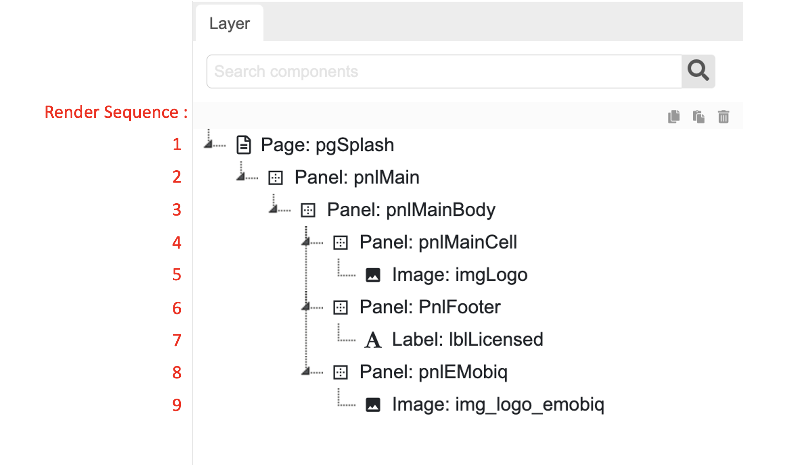

# Page Rendering Behaviour

## Overview
<!-- 
Page rendering is a crucial aspect of visual presentation in mobile applications built using eMOBIQ no-code development platform. This documentation aims to explain the concept of page rendering in eMOBIQ in a simplified manner, accessible to non-programmers. Additionally, it provides a suggested illustration to aid in understanding the rendering process.

## Page Rendering in eMOBIQ -->

Page rendering in eMOBIQ refers to the process of organising and displaying the components of mobile app pages to users. Pages in eMOBIQ may consist of various components, including buttons, text boxes, images, and more.

## Hierarchy of Components in eMOBIQ

Each page within eMOBIQ's app-building framework contains a hierarchy of components that defines their arrangement and relationship. Components in eMOBIQ can be visualised as individual elements or building blocks that contribute to the overall structure of the page. The hierarchy represents the organization of these components in a structured manner.

## Depth-First Rendering in eMOBIQ

eMOBIQ adopts a depth-first rendering approach to ensure an orderly display of components in pages. The rendering process begins with the top-level component and systematically progresses through the hierarchy, rendering each component encountered along the way.

To provide a visual representation of the rendering sequence, take a look at the example image below. This image showcases a simplified page hierarchy in eMOBIQ's layer section:

In the image, you can see the expanded hierarchy of components within the layer section. The render sequence in this example will be:
1. Page: pgSplash
2. Panel: pnlMain
3. Panel: pnlMainBody
4. Panel: pnlMainCell
5. Image: imgLogo
6. Panel: pnlFooter
7. Label: lblLicensed
8. Panel: pnlEMobiq
9. Image: img_logo_emobiq

The rendering process follows a top-to-bottom sequence, where the top-level component is rendered first, followed by its child components, and so on, until reaching the bottom-level components. This sequence ensures that each component is rendered in the correct order, resulting in the desired visual arrangement of the page.

<!-- By understanding this rendering sequence and visualizing it through the provided image, users can gain a clearer understanding of how eMOBIQ renders components in a depth-first manner to create well-structured mobile applications. -->

## Analogy

Imagine you have a set of nesting dolls, where each doll contains smaller dolls inside. To explore the dolls using a depth-first approach, you start with the outermost doll and open it to reveal the next doll inside. You continue this process, recursively opening each doll until you reach the innermost one.

Similarly, in eMOBIQ's depth-first rendering, the top-level component is like the outermost doll. It gets rendered first, and then the rendering engine dives deeper into the hierarchy, rendering each child component encountered along the way. This recursive process continues until all components in the hierarchy have been rendered.

## Conclusion

Understanding the depth-first rendering approach in eMOBIQ is essential for building well-organized mobile applications. By envisioning the nesting doll analogy, where components are explored recursively, users can grasp the sequential and systematic nature of the rendering process. This knowledge empowers individuals to design cohesive and visually appealing mobile apps using the eMOBIQ no-code platform.