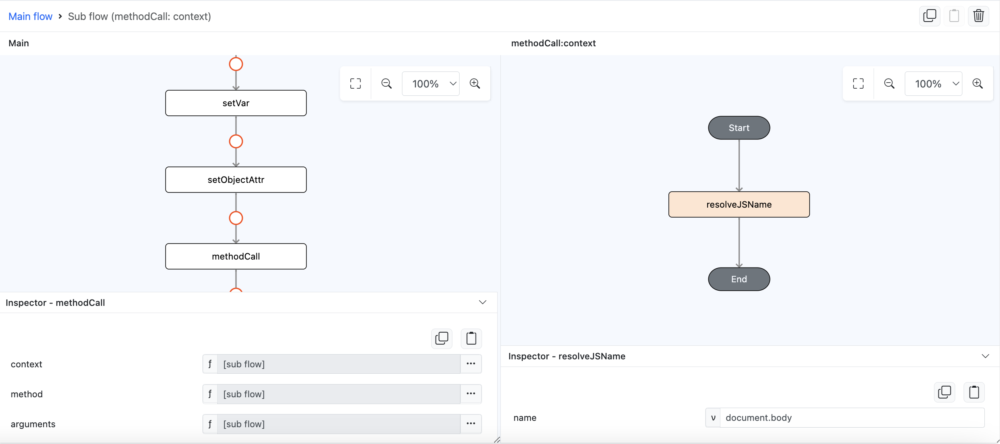

# methodCall

## Description

Runs the method using the object assigned in context parameter.

## Input / Parameter

| Name | Description | Input Type | Default | Options | Required |
| ------ | ------ | ------ | ------ | ------ | ------ |
| context  | This is the context (object) that the method will run on. | Object | - | - | Yes |
| method  | The method to run or call. | Object | - | - | Yes |
| arguments  | The arguments that will be passed to method. | Array/List | - | - | Yes |

## Output

| Description | Output Type |
| ------ | ------ |
| The return type of methodCall depends on the function that is passed as the method. Specifically, it will return the result of invoking the method with the given context and arguments. | Any |

## Example

In this example, we will use function `methodCall` to add a new div element in the document body by getting `document` object using `resolveJSName` function.

### Code Equivalent

```
// Create div element
var div = document.createElement("div");

// Add some attribute to the div
div.className = "class";

// Add to the body
document.body.appendChild(div);
```

### Steps

1. Drag a `button` component into the canvas and open the `Action` tab. Select the `press` event of the button and drag the `setVar` function to the event flow.
2. On `setVar` function `var` param add `div` as the value and on it's `value` param add a subflow and drag a function `methodCall`.
3. On it's `context` param add a subflow and drag a function `resolveJSName`, on it's `name` param add the value `document`.

    <div style="display:flex; align-items:center; justify-content:center; background-color: #E7F1FF;">
        
    </div>

4. On it's `method` param add a subflow and drag a function `objectAttr`, on it's `object` param add a subflow and drag a function `resolveJSName`, on it's `name` param add the value `document`. Back on the function `objectAttr` on it's `attr` param add the value `createElement`.

    <div style="display:flex; align-items:center; justify-content:center; background-color: #E7F1FF;">
        
    </div>

5. On it's `arguments` param add a subflow and drag a function `toArray`, on it's `value1` param add the value `div`.

    <div style="display:flex; align-items:center; justify-content:center; background-color: #E7F1FF;">
        
    </div>

6. Back to main flow, drag the `setObjectAttr` function to the event flow, on it's `object` param add a subflow and drag a function `getVar`, on it's `var` param add the value `div`. As for the `attr` param add the value `className` and for the `value` param add the value `class`.

    <div style="display:flex; align-items:center; justify-content:center; background-color: #E7F1FF;">
        
    </div>

7. Back to main flow, drag the `methodCall` function to the event flow, on it's `context` param add a subflow and drag a function `resolveJSName`, on it's `name` param add the value `document.body`.

    <div style="display:flex; align-items:center; justify-content:center; background-color: #E7F1FF;">
        
    </div>

8. On it's `method` param add a subflow and drag a function `objectAttr`, on it's `object` param add a subflow and drag a function `resolveJSName`, on it's `name` param add the value `document.body`. Back on the function `objectAttr` on it's `attr` param add the value `appendChild`.

    <div style="display:flex; align-items:center; justify-content:center; background-color: #E7F1FF;">
        
    </div>

9. On it's `arguments` param add a subflow and drag a function `toArray`, on it's `value1` param add a subflow and drag a function `getVar`, on it's `var` param add the value `div`.

    <div style="display:flex; align-items:center; justify-content:center; background-color: #E7F1FF;">
        
    </div>

### Result

1. Now click the button in preview, check the inspector, you will see a new div element being added on the body

    <div style="display:flex; align-items:center; justify-content:center; background-color: #E7F1FF;">
        
    </div>

## Links

### Related Information

See also:

- Functions
    -  [resolveJSName](/document/client/006-actions-and-visual-logic/action-reference/cordova/App/resolveJSName/resolveJSName.md)