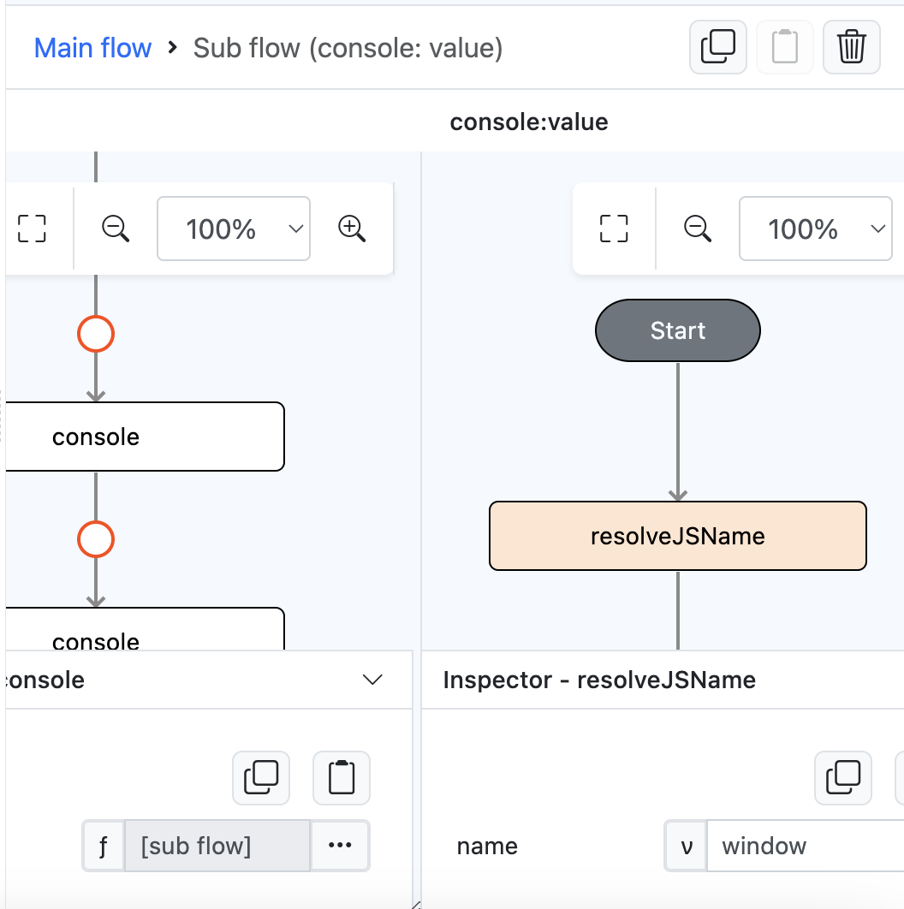
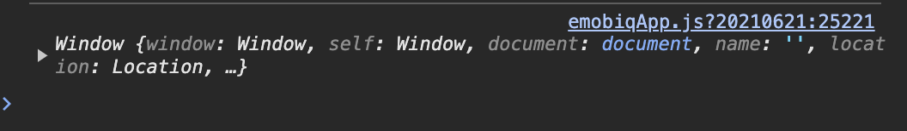

# resolveJSName

## Description

Returns the javascript built in object or user defined object.

## Input / Parameter

| Name | Description | Input Type | Default | Options | Required |
| ------ | ------ | ------ | ------ | ------ | ------ |
| name | The name of the javascript built in object to resolve. (example: document, window, document.body) | String/Text | - | - | Yes |

## Output

| Description | Output Type |
| ------ | ------ |
| Returns the javascript built in object or user defined object that matches with the name param | Object |

## Example

In this example, we will get `window` object using `resolveJSName` function and put it inside `console` value to see the object in preview

### Steps

1. Drag a `button` component into the canvas and open the `Action` tab. Select the `press` event of the button and drag the `console` function to the event flow.
2. Call the function `resolveJSName` inside the `console`'s `value` subflow.
3. Add the value `window` on `name` param in the `resolveJSName` function. 

    

        
    

### Result

1. Now click the button in preview, it will show the `window` object on the console

    

        
    

## Links

### Related Information