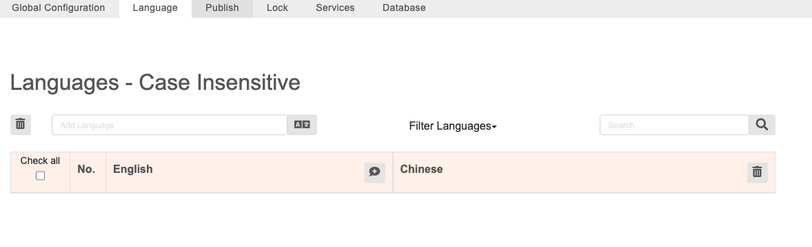
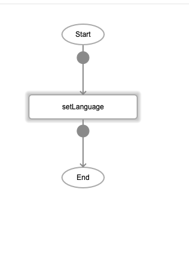
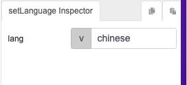
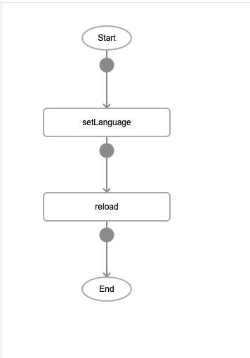

# setLanguage

## Description

Allows users to set a default language for the app from the pre-defined languages in language settings.

## Input / Parameter

| Name | Description | Input Type | Default | Options | Required |
| ------ | ------ | ------ | ------ | ------ | ------ |
| lang | The name of the language to be set as default. | String/Text | - | - | Yes |

## Output

N/A

Note: The component will be updated to show the translated text in the language specified by the user.

## Callback

N/A

## Video

Coming Soon.

<!-- Format:  -->

## Example

The user override the default language (English) of their App.

### Step

1. Go to language setting tab add language "chinese", add label "Language" and assign chinese word for the label as below:

    
    
2. Draw a Label with "Language" Caption, a button "setLanguage"

    
    
3. Call the function

    
    
4. Reload

    

### Result

The word "Language" will be changed to "语言选择".  

### Notes

- In the language setting, the word used for mapping is case sensitive.

## Links