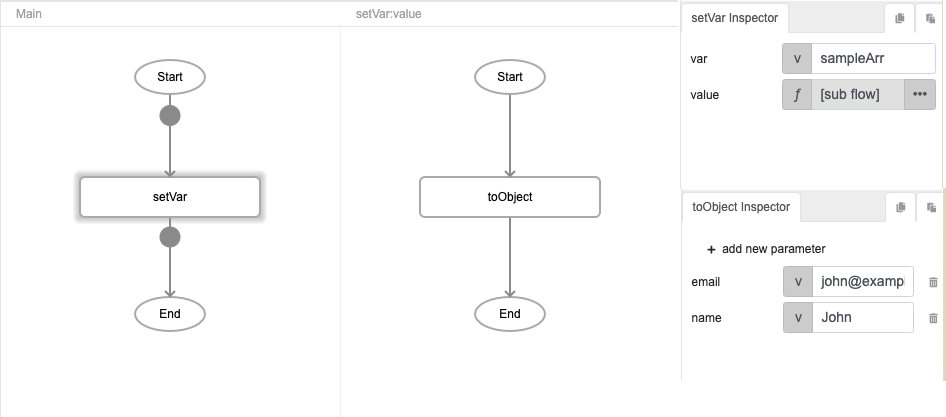
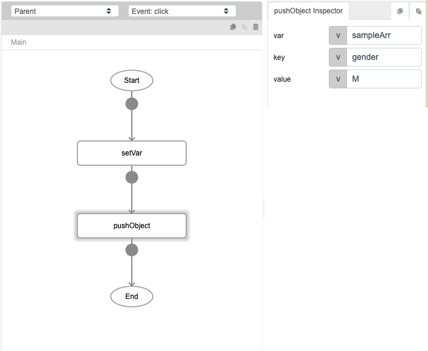
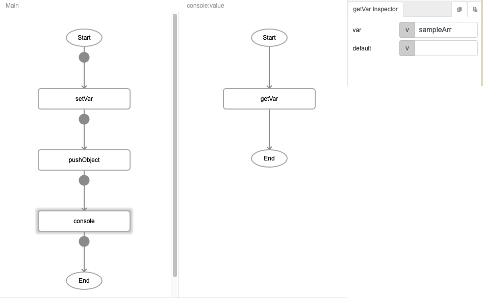
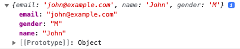

# pushObject

## Description

Adds an object to an array.

## Input / Parameter

| Name | Description | Input Type | Default | Options | Required |
| ------ | ------ | ------ | ------ | ------ | ------ |
| var | The array of values to add an object to. | String/Text | - | - | Yes |
| key | The index of the array to add the object to. | String/Text | - | - | Yes |
| value | The value of the object to add to the array. | String/Text | - | - | Yes |

## Output

| Description | Output Type |
| ------ | ------ |
| The updated array with the object added. | Array/List |

## Callback

N/A

## Video

Coming Soon.

<!-- Format:  -->

## Example

Coming Soon.

<!-- Share a scenario, like a user requirements. -->

### Steps

1. First we will create an existing array with the `setVar` function. 
    
    For "var" we will use the name `sampleArr`. 

    For "value", we will use the `toObject` function to pass the name and email values.

    

2. Next, we will use the `pushObject` function to add an object to our existing `sampleArr` created in step 1. 

    | Field | Value | 
    | ---- | ---- | 
    | var | sampleArr | 
    | key | gender | 
    | value | M | 

    

3. Finally, we use the `console` function to verify the contents of our new `sampleArr` array. 

    

### Result

We should expect to see this in the console. 

<!-- Explain the output.

Format:  -->

## Links