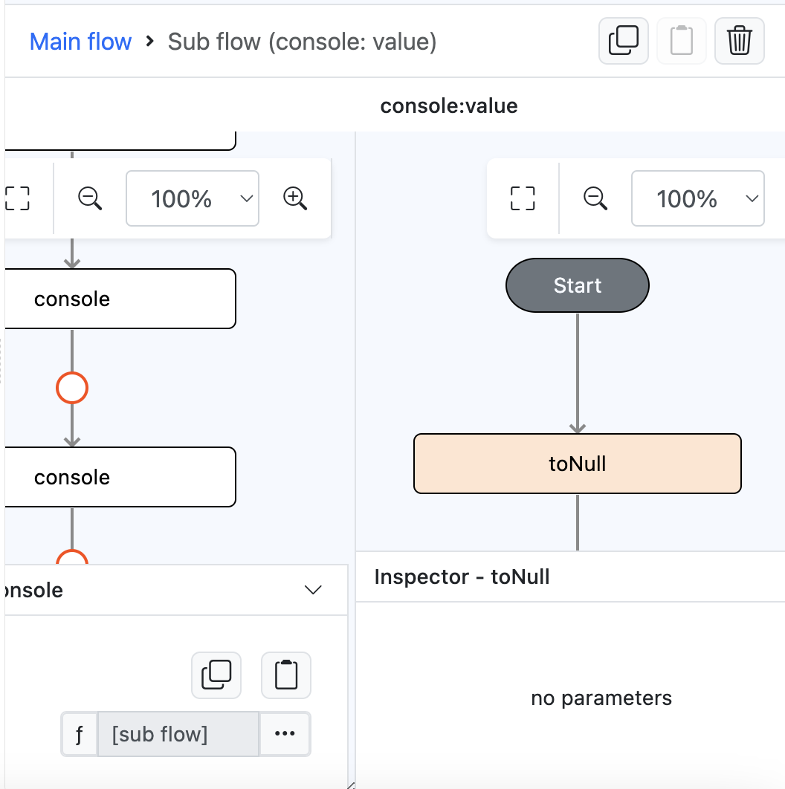

# toNull

## Description

will just return null.

## Input / Parameter

N/A

## Output

| Description | Output Type |
| ------ | ------ |
| Returns null value. | Null |

## Example

In this example, we will use the `toNull` function to print `null` in the console.

### Step
1. Drag a `button` component into the canvas and open the `Action` tab. Select the `press` event of the button and drag the `console` function to the event flow.
2. Call the function `toNull` inside the `console` value subflow.

    

        
    

### Result

1. The console will print `null`.

    

        
    

