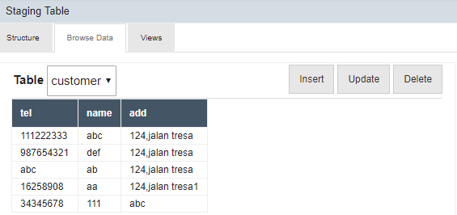
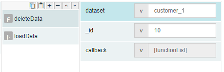
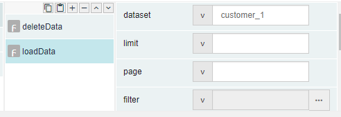
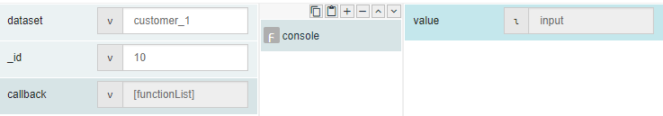
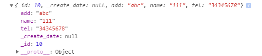
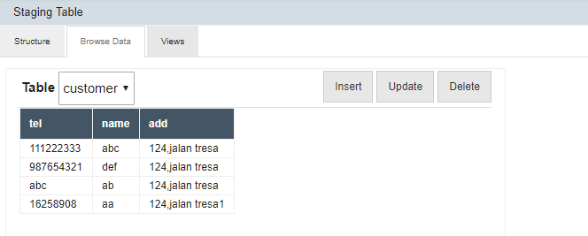

# deleteData 

## Description

Delete a record from a staging database.

## Input / Parameters

| No | Name | Description | Data Type | Required |
| ------ | ------ | ------ |------ | ------ |
| 1 | dataset | Name of the dataset in staging table which will be deleted. | String | Yes  |
| 2 | _id | Value from the staging database and used for identify which record will be updated. | Integer | Yes  |

## Output

## Callback

## Video

## Example

The user wants to delete the data from staging table.

### Step

1. Create a table with a table name and fields in staging table and             create a dataset in Services. (We assumed that the table ,               fields and dataset have been created.)
    
   table name: customer 
   Fields name: tel, name and add 
   Dataset: customer_1 
   Set value: tel:34345678, name: 111, add:abc 
        
   
        
2. Call the function "deleteData", define the dataset and id. 
    
   dataset: customer_1 
   _id: 10 
   
   
 
3. Call the function "loadData" and set the dataset.
    
   dataset: customer_1 
   
   
   
4. Add a console after callback for display the response from               console.
 
   
   

### Result

 
 
  
 ( The result display in editor.)
 
 
( The row for tel:34345678, name: 111, add:abc have been remove successfully.)

## Links