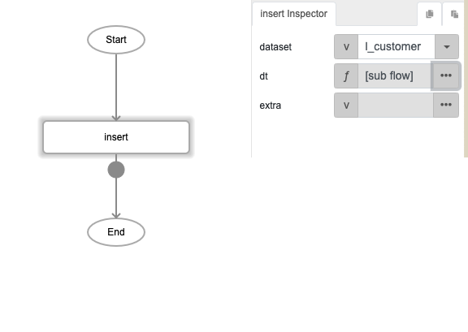
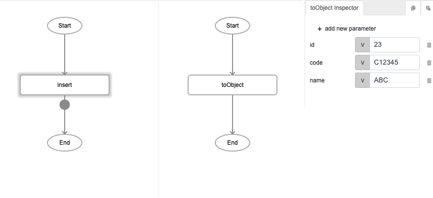
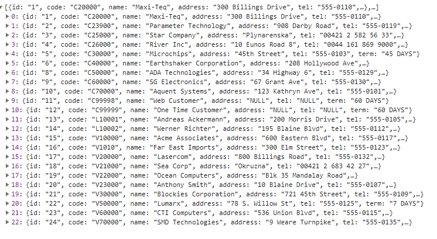
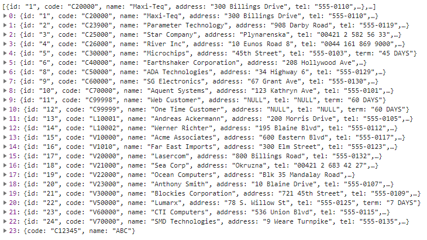

# insert 

## Description

Inserts values specified by the user into a local table.

## Input / Parameter

| Name | Description | Input Type | Default | Options | Required |
| ------ | ------ | ------ | ------ | ------ | ------ |
| dataset | The name of the local table to be insert data to. | String/Text | - | - | Yes |
| dt | The values to be inserted in the local table. | Object | - | - | Yes |
| extra | Extra parameters stored and passed to callback. | Any | - | - | No |

## Output

| Description | Output Type |
| ------ | ------ |
| Returns the updated local table as a list. | Array/List |

## Callback?

### callback

The function to be executed if the local table is updated with the new records successfully.

### errCallback

The function to be executed if the local table is not updated with the new records successfully.

## Video

Coming Soon.

<!-- Format:  -->

## Example

The user wants to insert the id=23 into the dataset "l_customer".

### Step

1. Call the function "insert" and define the dataset    and dt.
    
   dataset: l_customer 
   
   
  
2. Set toObject function to dt and define the value    of object.
    
   dt: toObject 
   id: 23 
   code: C12345 
   name: ABC 
   
   
   
### Result

( Before insert, the id is until id=22 )

( After insert, the id=23 successful add into the dataset "l_customer" )
   

## Links