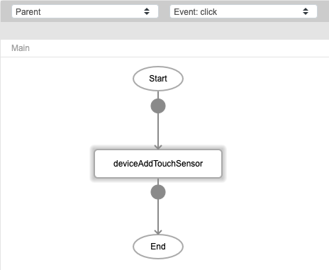
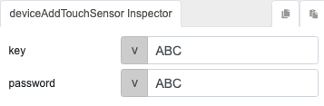
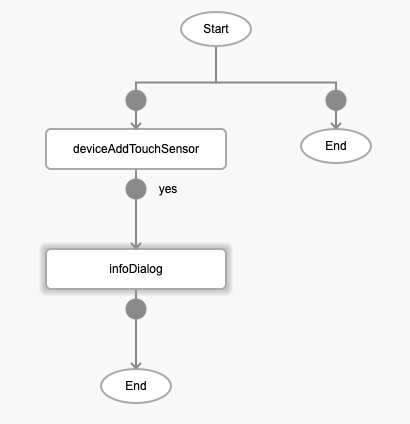
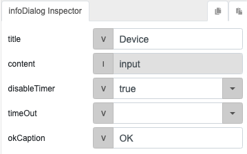

# deviceAddTouchSensor

## Description

Adds touch sensor feature for the user's mobile device. To be able to use this function properly, the mobile device must have a touch sensor and the user must set up the fingerprint authentication in their device setting beforehand.

## Input / Parameter

| Name | Description | Input Type | Default | Options | Required |
| ------ | ------ | ------ | ------ | ------ | ------ |
| key | The key in the device keychain. | String/Text | - | - | Yes |
| password | The password used to create the credential string for encrypted token.. | String/Text | - | - | Yes |

## Output

N/A

## Callback

### callback

The function to be executed if touch sensor feature is added successfully.

## Video

Coming Soon.

<!-- Format:  -->

## Example

The user wants to add touch sensor to their mobile device.

<!-- Share a scenario, like a user requirements. -->

### Steps

| No. | Description |  |
| ------ | ------ | ------ |
| 1. |  | Drag a button component to a page in the mobile designer. Select the event `click` and drag the `deviceAddTouchSensor` function to the event flow. |
| 2. |  | Fill in the parameters of the function. |
| 3. |  | Drag the function that is executed when the touch sensor feature is added to the mobile device successfully. In this example, we are using the `infoDialog` function. |
| 4. |  | Fill in the parameters of the function. |

<!-- Show the steps and share some screenshots.

1. .....

Format:  -->

### Result

When the button is pressed, the mobile device will ask for fingerprint authentication. Touch the touch sensor of the device for the fingerprint to be recognized. The dialog will show the input passed.

<!-- Explain the output.

Format:  -->

## Links