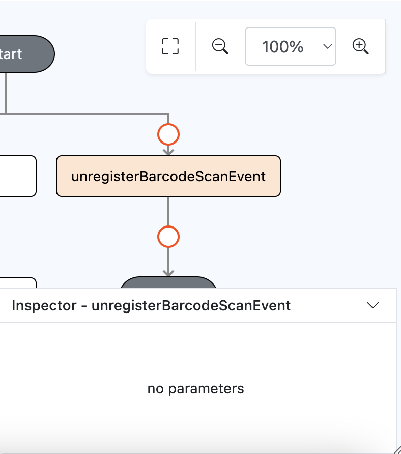

# unregisterBarcodeScanEvent

## Description

Clear all barcode scan event

## Input / Parameter

N/A

## Output

## Callback

## Video

## Example

### Step

1. Call the function

    

    
### Result

### Video

- N/A
<!---->

## Links

- N/A