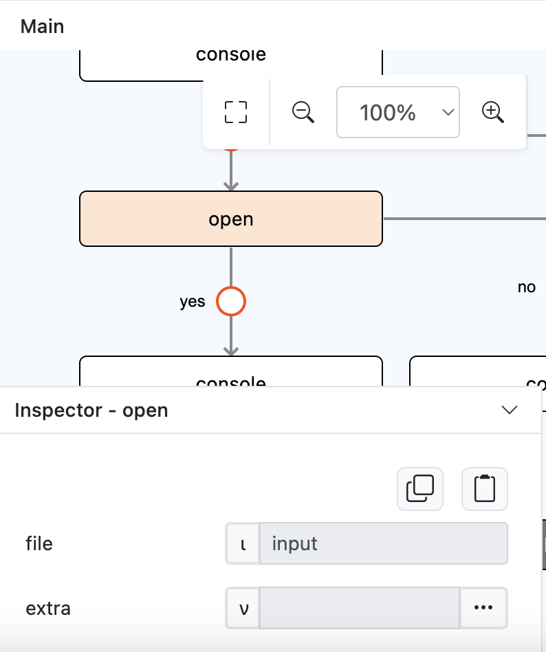
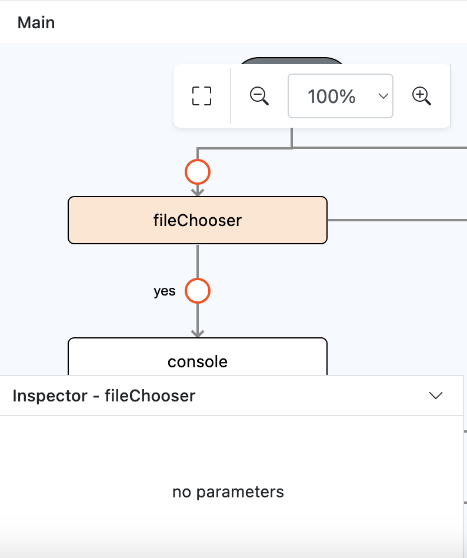
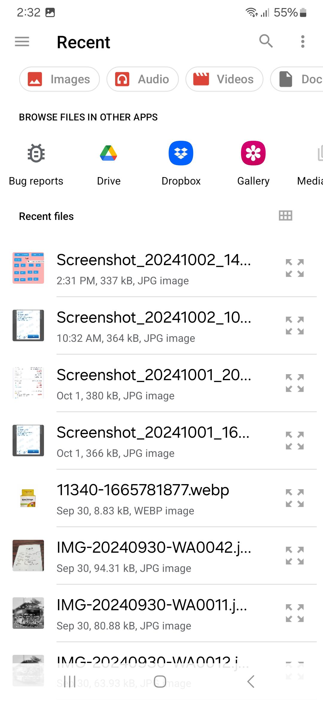
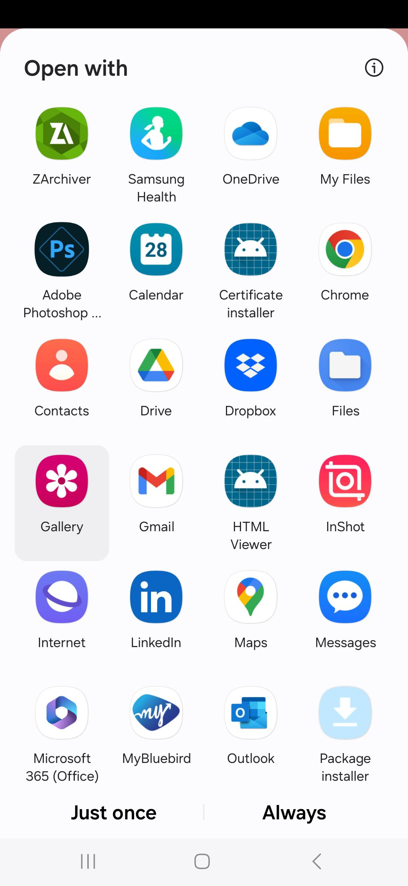
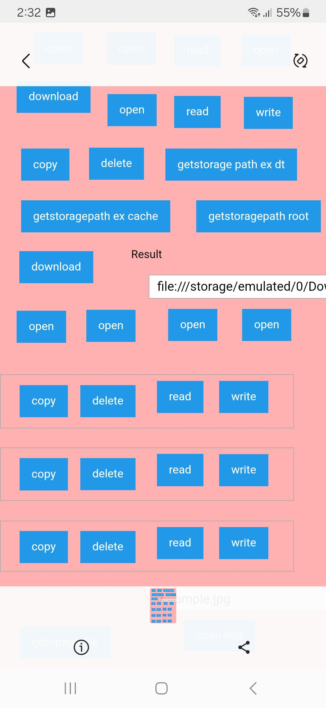

# open

## Description

To open any file with a the available local external mobile application available.

## Input / Parameter

| Name | Description | Input Type | Default | Options | Required |
| ------ | ------ | ------ | ------ | ------ | ------ |
| file | The full file path of the file to be opened. | Text | - | - | Yes |
| extra | Passed value so that it can be access by extra type value. | Any | - | - | No |

## Output

N/A

## Callback

### callback

The action performed if this function runs successfully.

| Description | Output Type |
| ------ | ------ |
| Successful text massage  | Text |

### errorCallback

The action performed if this function does not run successfully.

| Description | Output Type |
| ------ | ------ |
| Returns an error message. | Text |

## Example

In this example, we will open a file that we chose from a file explorer app using a `fileChooser` function.

```js
Note: This example will only work if the user has a file on their device with the suitable app to open the file.
```

### Steps

1. Drag a button component to a page in the mobile designer, select the component and on the event `press` drag the `fileChooser` function to the event flow.

    <div style="display:flex; align-items:center; justify-content:center; background-color: #E7F1FF;">
        
    </div>

2. Inside the `fileChooser` function `yes` callback add the `open` function and fill in the parameter with `input` as the param type for `file`.

    <div style="display:flex; align-items:center; justify-content:center; background-color: #E7F1FF;">
        
    </div>

### Result

1. Open the installed app on a device and press the button, it should open up the file explorer app so we can choose from there.

    <div style="display:flex; align-items:center; justify-content:center; background-color: #E7F1FF;">
        
    </div>

2. If the file and the suitable apps for opening that file exists, user should be able to see the popup where they can choose which app that they want to use for opening the file. Note: If there's only one app in the user device that's suitable for opening the file or the user had chosen a default app for opening that file type, it will automatically open that app without showing the app chooser popup.

    <div style="display:flex; align-items:center; justify-content:center; background-color: #E7F1FF;">
        
    </div>

3. Check the file content using previously selected suitable app.

    <div style="display:flex; align-items:center; justify-content:center; background-color: #E7F1FF;">
        
    </div>

## Links

### Related Information

See also:

- Functions
    -  [fileChooser](/document/client/006-actions-and-visual-logic/action-reference/cordova/Device/fileChooser/fileChooser.md)