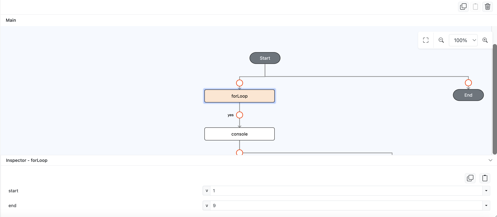
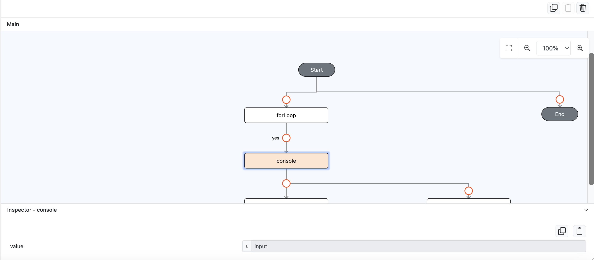
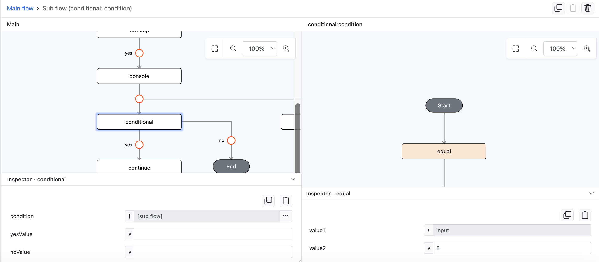
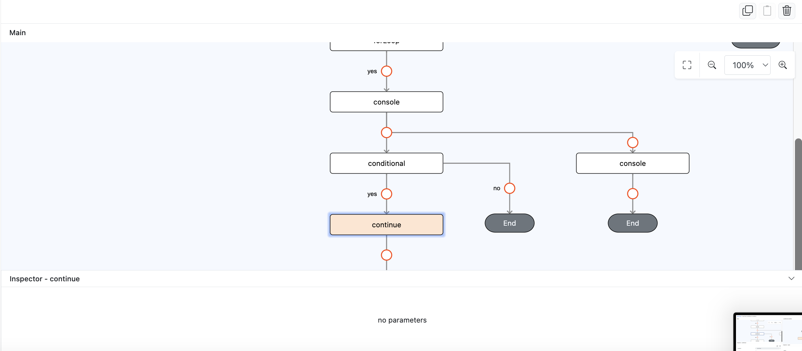
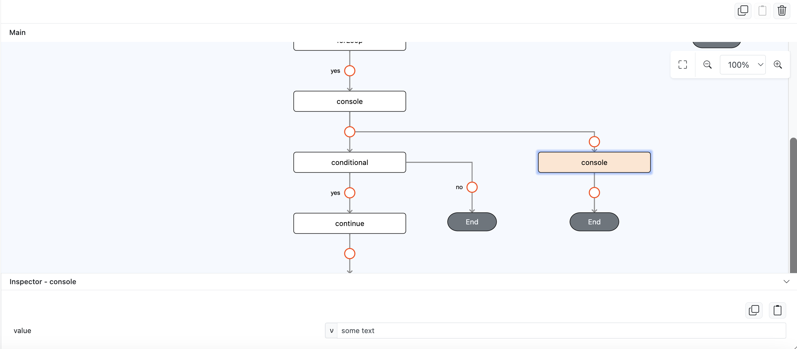
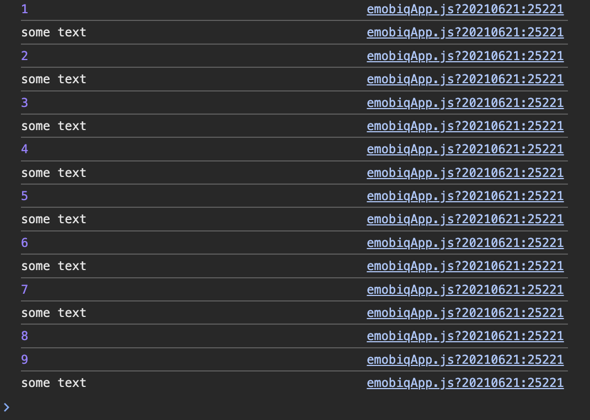

# continue

## Description

Will continues to the next iteration of loop 

## Input / Parameter

N/A

## Output

N/A

## Callback

N/A

## Example

In this example, we will do console logging by using `console` function in `forLoop` function callback to demonstrate how `continue` works.

### Code Equivalent

```
for (let i = 1; i < 10; i++) {
  console.log(i);
  
  if (i == 8) {
    // Continue to next iteration
    continue;
  }
  
  console.log("some text")
}
```

### Steps

1. Drag a `button` component into the canvas and open the `Action` tab. Select the `press` event of the button and drag the `forLoop` function to the event flow, add the value `1` on `start` param and add the value `9` on `end` param.

    <div style="display:flex; align-items:center; justify-content:center; background-color: #E7F1FF;">
        
    </div>

2. Drag the function `console` to the `forLoop` function yes callback, on it's `value` param change the param type to input.

    <div style="display:flex; align-items:center; justify-content:center; background-color: #E7F1FF;">
        
    </div>

3. Drag the function `conditional` inside function `forLoop` yes callback, on param `condition` change the param type to subflow/function. Inside param `condition` subflow add `equal` function then on it's `value1` param change the param type to input and on it's `value2` param add value `8`.

    <div style="display:flex; align-items:center; justify-content:center; background-color: #E7F1FF;">
        
    </div>

4. Drag the function `continue` inside function `conditional` yes callback.

    <div style="display:flex; align-items:center; justify-content:center; background-color: #E7F1FF;">
        
    </div>

5. Drag the function `console` after function `conditional`, add value `some text` on it's `value` param.

    <div style="display:flex; align-items:center; justify-content:center; background-color: #E7F1FF;">
        
    </div>

### Result

1. Now click the button in preview, it will show the list current loop number followed with `some text` on the console, notice that the `continue` function will ignore the 8th `some text`.

    <div style="display:flex; align-items:center; justify-content:center; background-color: #E7F1FF;">
        
    </div>

## Links

### Related Information

See also:

- Functions
    -  [conditional](/document/client/006-actions-and-visual-logic/action-reference/cordova/Flow/conditional/conditional.md)