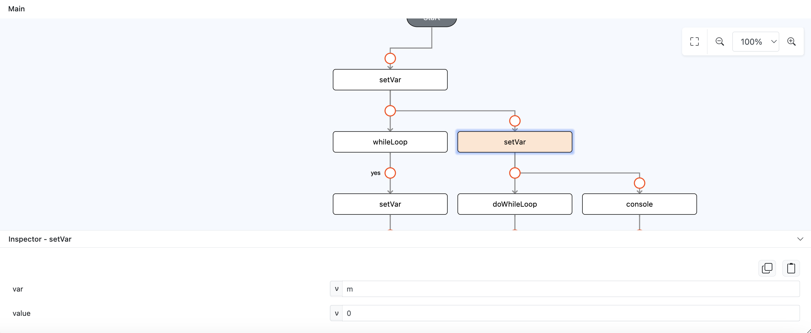
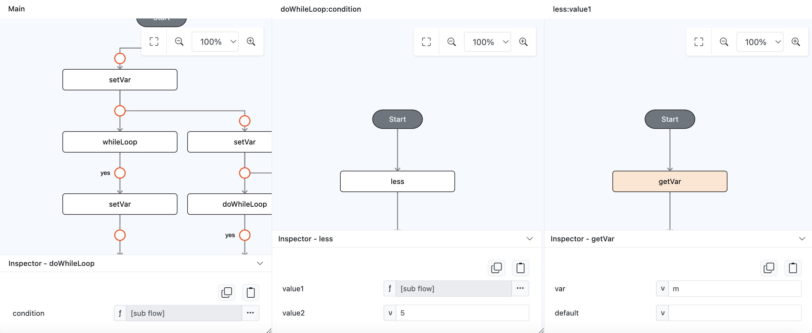
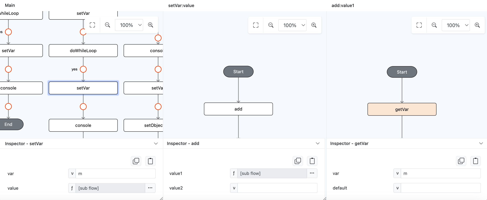
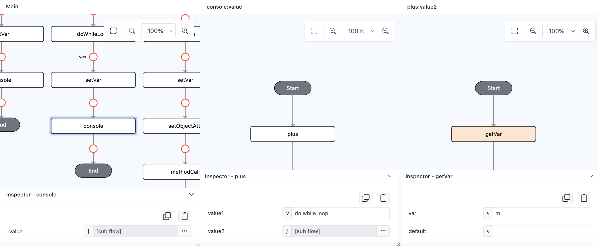
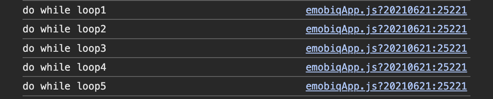

# doWhileLoop

## Description

Loop runs, and it continues to repeat as long as the condition remains true, executes the loop first then evaluates the condition.

## Input / Parameter

| Name | Description | Input Type | Default | Options | Required |
| ------ | ------ | ------ | ------ | ------ | ------ |
| condition | The condition to evaluates after the loop | boolean | - | - | Yes |

## Output

N/A

## Callback

### yesCallback

This will be triggered for every loop that happens while the condition remains true.

## Example

In this example, we will do console logging by using `console` function in `doWhileLoop` callback

### Code Equivalent

```
let m = 0;
do {
  m++;
  console.log("do while loop"+m);
} while(m < 5);
```

### Steps

1. Drag a `button` component into the canvas and open the `Action` tab. Select the `press` event of the button and drag the `setVar` function to the event flow, add the value `m` on `var` param and add the value `0` on `value` param.

    <div style="display:flex; align-items:center; justify-content:center; background-color: #E7F1FF;">
        
    </div>

2. Drag the function `doWhileLoop` to the eventflow, on it's `condition` param change the param type to function/subflow then add function `less` inside the subflow, for the `value1` param change the param type to function/subflow then add function `getVar` inside the subflow, for the `var` param add value `m`.

    <div style="display:flex; align-items:center; justify-content:center; background-color: #E7F1FF;">
        
    </div>

3. Drag the function `setVar` inside function `doWhileLoop` yes callback, add value `m` on param `var` and change the param type to subflow/function on param `value`. Inside param `value` subflow add `add` function then on it's `value1` change the param type to subflow/function, add `getVar` function in it, then put `m` on it's `var` param value.

    <div style="display:flex; align-items:center; justify-content:center; background-color: #E7F1FF;">
        
    </div>

4. Drag the function `console` inside function `doWhileLoop` yes callback, change the param type to subflow/function on param `value`. Inside param `value` subflow add `plus` function then on it's `value1` param add `do while loop` value, as for `value2` param change the param type to subflow/function, add `getVar` function in it, then put `m` on it's `var` param value.

    <div style="display:flex; align-items:center; justify-content:center; background-color: #E7F1FF;">
        
    </div>

### Result

1. Now click the button in preview, it will show the list of `do while loop` with the current loop number on the console.

    <div style="display:flex; align-items:center; justify-content:center; background-color: #E7F1FF;">
        
    </div>

## Links

### Related Information

See also:

- Functions
    -  [plus](/document/client/006-actions-and-visual-logic/action-reference/cordova/Math/plus/plus.md)