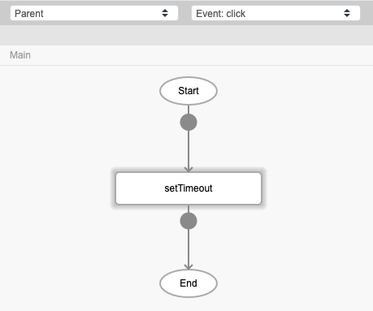
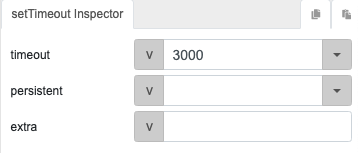
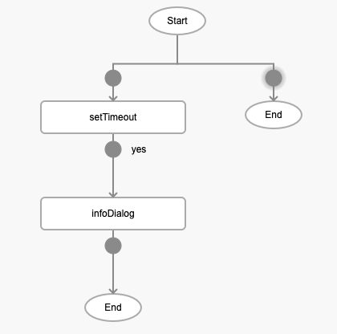
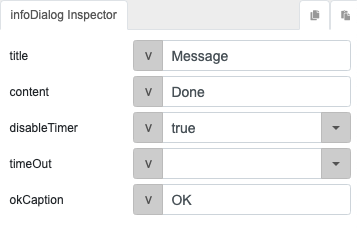
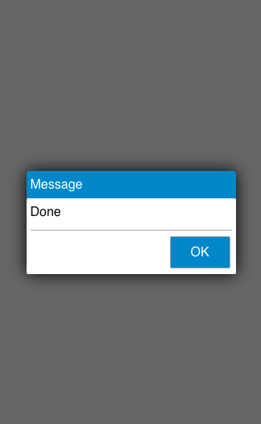

# setTimeout

## Description

Calls a function or evaluates an expression after a specified number of seconds.

## Input / Parameter

| Name | Description | Input Type | Default | Options | Required |
| ------ | ------ | ------ | ------ | ------ | ------ |
| timeout | The time before a function is executed, in milliseconds. | Number | 0 | - | No |
| persistent | To identify whether this should still be executed outside the current active page. | Boolean | false | true, false | No |
| extra | The value to be included to the 'callback' as a system value under 'extra'. | Any | - | - | No |

## Output

N/A

## Callback

### yesCallback

The function to be executed after the timeout.

## Video

Coming Soon.

<!-- Format:  -->

## Example

The user wants to display the infoDialog after 3 seconds.

### Step

1. Call the function `setTimeout` to a button component with event `click` and enter the duration of the timeout.
    
   timeout: 3000 
  
    

    
    
2. Call the function `infoDialog` in the callback of the `setTimeout` function to display a infoDialog after 3 seconds.
    
   title: Message 
   content: Done 
   disableTimer: true 
   
    

    
    
### Result

When the button is pressed, the infoDialog will appear after 3 seconds.

## Links