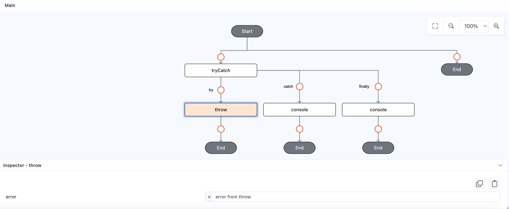

# throw

## Description

Intentionally throw an error. When you throw an error, the normal flow of code execution stops, and control is passed to the nearest catch block, while passing the error message.

## Input / Parameter

| Name | Description | Input Type | Default | Options | Required |
| ------ | ------ | ------ | ------ | ------ | ------ |
| value | The error message to throw. | Text/String | - | - | No |

## Output

N/A

## Callback

N/A

## Example

In this example, we will do console logging by using `console` and `throw` function in `tryCatch` function callback to demonstrate how `throw` works.

### Code Equivalent

```
try {
  throw new Error("There is an error");
} catch (e) {
  console.log(e)
} finally {
  console.log("finally");
}
```

### Steps

1. Drag a `button` component into the canvas and open the `Action` tab. Select the `press` event of the button and drag the `tryCatch` function to the event flow.

    <div style="display:flex; align-items:center; justify-content:center; background-color: #E7F1FF;">
        
    </div>

2. Drag the function `throw` to the `tryCatch` function try callback, on it's `value` param add `error from throw` as value.

    <div style="display:flex; align-items:center; justify-content:center; background-color: #E7F1FF;">
        
    </div>

3. Drag the function `console` to the `tryCatch` function catch callback, on it's `value` param change the param type to `input`.

    <div style="display:flex; align-items:center; justify-content:center; background-color: #E7F1FF;">
        
    </div>

4. Drag the function `console` to the `tryCatch` function catch callback, on it's `value` param add `finally` as value.

    <div style="display:flex; align-items:center; justify-content:center; background-color: #E7F1FF;">
        
    </div>

### Result

1. Now click the button in preview, it will only show `error from throw` and `finally` on the console.

    <div style="display:flex; align-items:center; justify-content:center; background-color: #E7F1FF;">
        
    </div>

## Links

### Related Information

See also:

- Functions
    -  [console](/document/client/006-actions-and-visual-logic/action-reference/cordova/App/console/console.md)
    -  [tryCatch](/document/client/006-actions-and-visual-logic/action-reference/cordova/Flow/tryCatch/tryCatch.md)