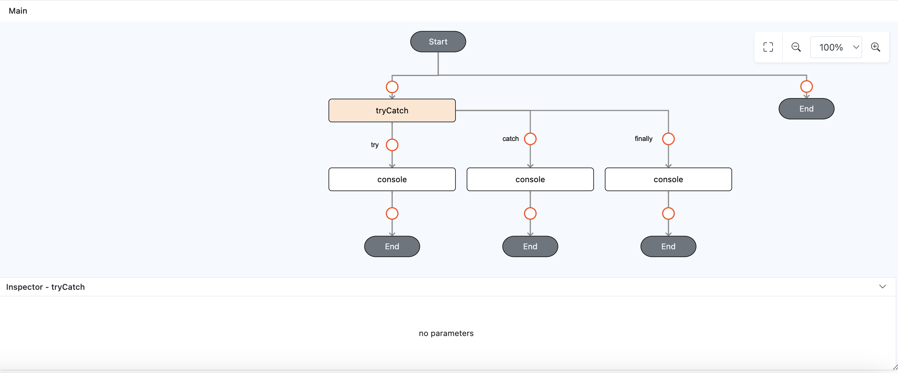
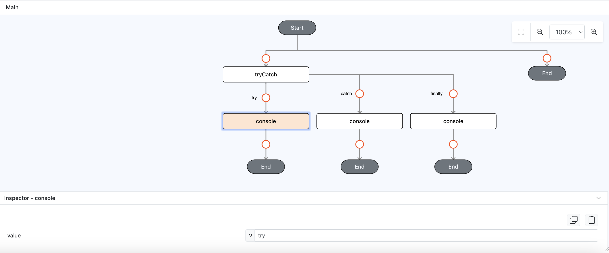
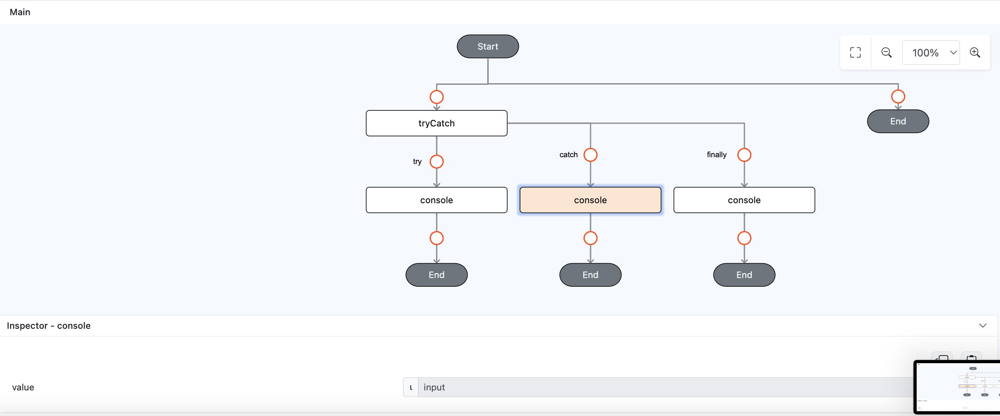
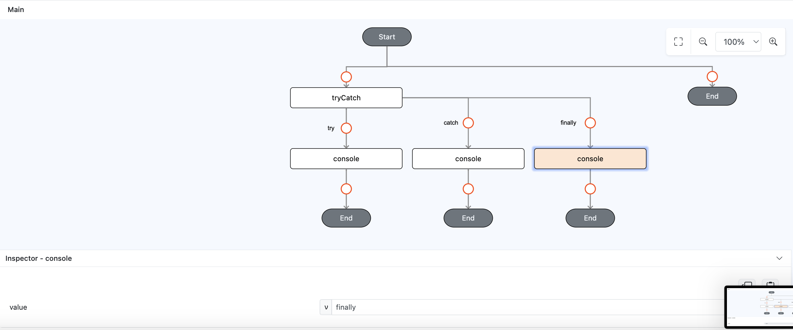
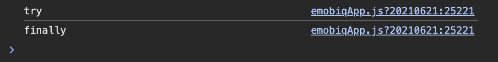

# tryCatch

## Description

Handling exceptions (errors) in code execution. It allows you to "try" a block of code, "catch" any errors that occur, and optionally "finally" execute some code regardless of whether an error was thrown or not

## Input / Parameter

N/A

## Output

N/A

## Callback

### try callback

The functions to be executed.

### catch callback

The functions to be executed when there is an exception.

| Description | Output Type |
| ------ | ------ |
| Returns an error. | Error |

### finally callback

The functions to be executed regardless of the exception is thrown or caught.

## Example

In this example, we will do console logging by using `console` function in `tryCatch` function callback to demonstrate how `tryCatch` works.

### Code Equivalent

```
try {
  console.log("try")
} catch (e) {
  console.log(e)
} finally {
  console.log("finally");
}
```

### Steps

1. Drag a `button` component into the canvas and open the `Action` tab. Select the `press` event of the button and drag the `tryCatch` function to the event flow.

    <div style="display:flex; align-items:center; justify-content:center; background-color: #E7F1FF;">
        
    </div>

2. Drag the function `console` to the `tryCatch` function try callback, on it's `value` param add `try` as value.

    <div style="display:flex; align-items:center; justify-content:center; background-color: #E7F1FF;">
        
    </div>

3. Drag the function `console` to the `tryCatch` function catch callback, on it's `value` param change the param type to `input`.

    <div style="display:flex; align-items:center; justify-content:center; background-color: #E7F1FF;">
        
    </div>

4. Drag the function `console` to the `tryCatch` function catch callback, on it's `value` param add `finally` as value.

    <div style="display:flex; align-items:center; justify-content:center; background-color: #E7F1FF;">
        
    </div>

### Result

1. Now click the button in preview, it will only show `try` and `finally` on the console.

    <div style="display:flex; align-items:center; justify-content:center; background-color: #E7F1FF;">
        
    </div>

## Links

### Related Information

See also:

- Functions
    -  [console](/document/client/006-actions-and-visual-logic/action-reference/cordova/App/console/console.md)