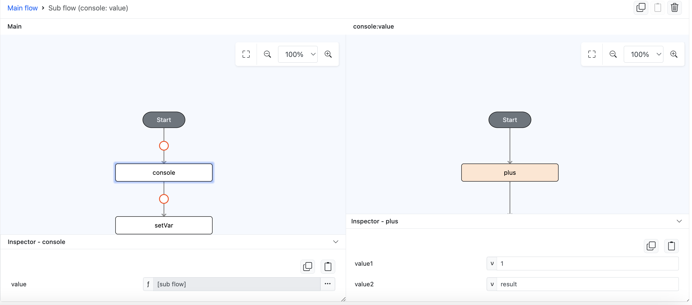

# plus

## Description

Adds two numbers or concat it if one of the operands is a string.

## Input / Parameter

| Name | Description | Input Type | Default | Options | Required |
| ------ | ------ | ------ | ------ | ------ | ------ |
| value1 | The first value to add/concat. | Number/Text/String | - | - | No |
| value2 | The second value to add/concat. | Number/Text/String | - | - | No |

## Output

| Description | Output Type |
| ------ | ------ |
| Returns the sum/concatenation of the two values. | Number/Text/String |

## Example

In this example, we will use function `plus` to concat a number and a string

### Steps

1. Drag a `button` component into the canvas and open the `Action` tab. Select the `press` event of the button and drag the `console` function to the event flow, and change the param type of `value` param to subflow/function.
2. Drag the `plus` function into the subflow, enter the 2 values to be added/concat together. For this example they are `1` for `value1` and `result` for `value2`.

    

        
    

### Results

1. Now click the button in preview, check the console, you will the result `1result`.

    

        
    

## Links

### Related Information