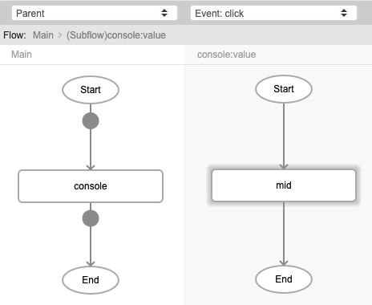
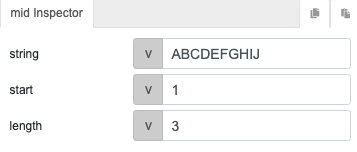
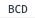

# mid

## Description

Extract a specified number of characters from any side of a text.

## Input / Parameter

| Name | Description | Input Type | Default | Options | Required |
| ------ | ------ | ------ | ------ | ------ | ------ |
| string | The value where the extraction would happen. | String/Text | - | - | Yes |
| start | The character count position where to start to extraction. The counting starts at 0. | Number | 0 | - | Yes |
| length | The number of characters to extract. | Number | 0 | - | Yes |

## Output

| Description | Output Type |
| ------ | ------ |
| Returns the extracted text. | String/Text |

## Callback

N/A

## Video

Coming soon.

## Example

The user wants to get a specific number of characters from a string, starting from the index specified. 

### Step

1. Call the function `console`. Call the function `mid` inside the `value` parameter of the `console` function.
     
    string: ABCDEFGHIJ 
    start: 1 
    length: 3 
    
    

    

### Result

## Links