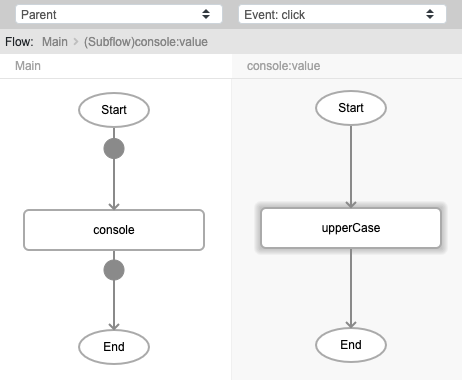
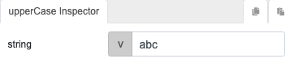
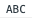

# upperCase

## Description

Converts all characters in a text to uppercase.

## Input / Parameter

| Name | Description | Input Type | Default | Options | Required |
| ------ | ------ | ------ | ------ | ------ | ------ |
| string | The value to be converted. | String/Text | - | - | Yes |

## Output

| Description | Output Type |
| ------ | ------ |
| Returns converted value. | String/Text |

## Callback

N/A

## Video

Coming soon.

## Example

The user wants to convert all the letters in the string from lower case to upper case.

### Step

1. Call the function `console`. Call the function `upperCase` inside the `value` parameter of the `console` function. 
   string: abc 
    
    

    

### Result

## Links