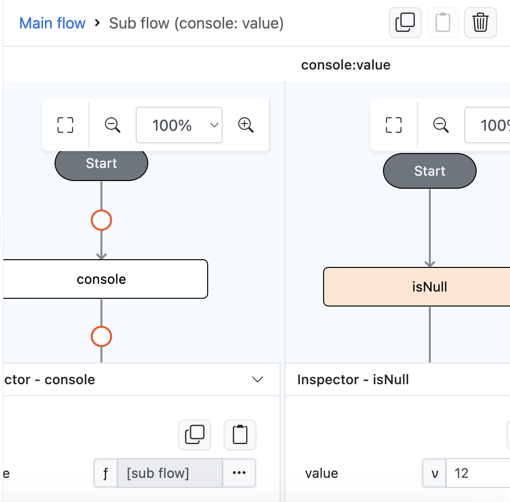

# isNull

## Description

Validates a value if it is null 

## Input / Parameter

| Name | Description | Input Type | Default | Options | Required |
| ------ | ------ | ------ | ------ | ------ | ------ |
| value | the value to validate. | Any | - | - | Yes |

## Output

| Description | Output Type |
| ------ | ------ |
| Returns the validation value. | Boolean |

## Example

In this example, we will check whether a value is null and print the result in the console.

### Step

1. Drag a `button` component into the canvas and open the `Action` tab. Select the `press` event of the button and drag the `console` function to the event flow.
2. Call the function `isNull` inside the `console` function.
3. Enter the value to be validated. In this example, we will enter the value "12".

    

        
    

### Result

1. The console will print `false` since it's not a null value.

    

        
    
