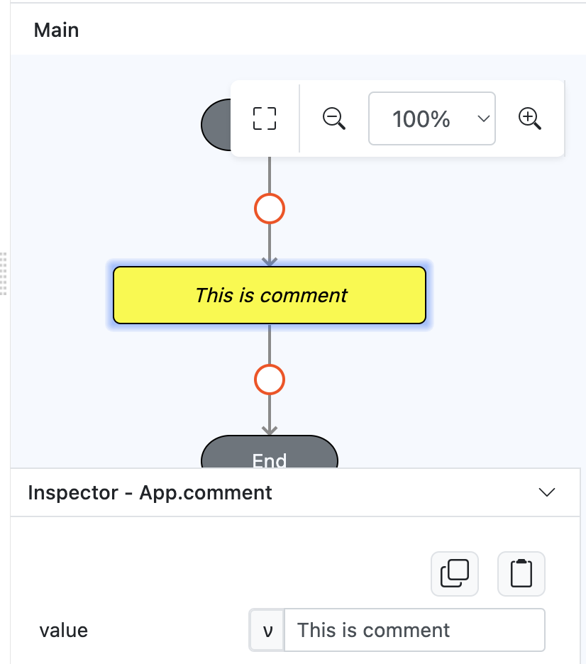

# App.comment

## Description

Adds a comment to an event flow.

## Input / Parameter

| Name | Description | Input Type | Default | Options | Required |
| ------ | ------ | ------ | ------ | ------ | ------ |
| value | The text value of the comment to be added. | Text | - | - | No |

### Steps

1. We will need to drag App.comment function and put value of comment.

    

        
    
