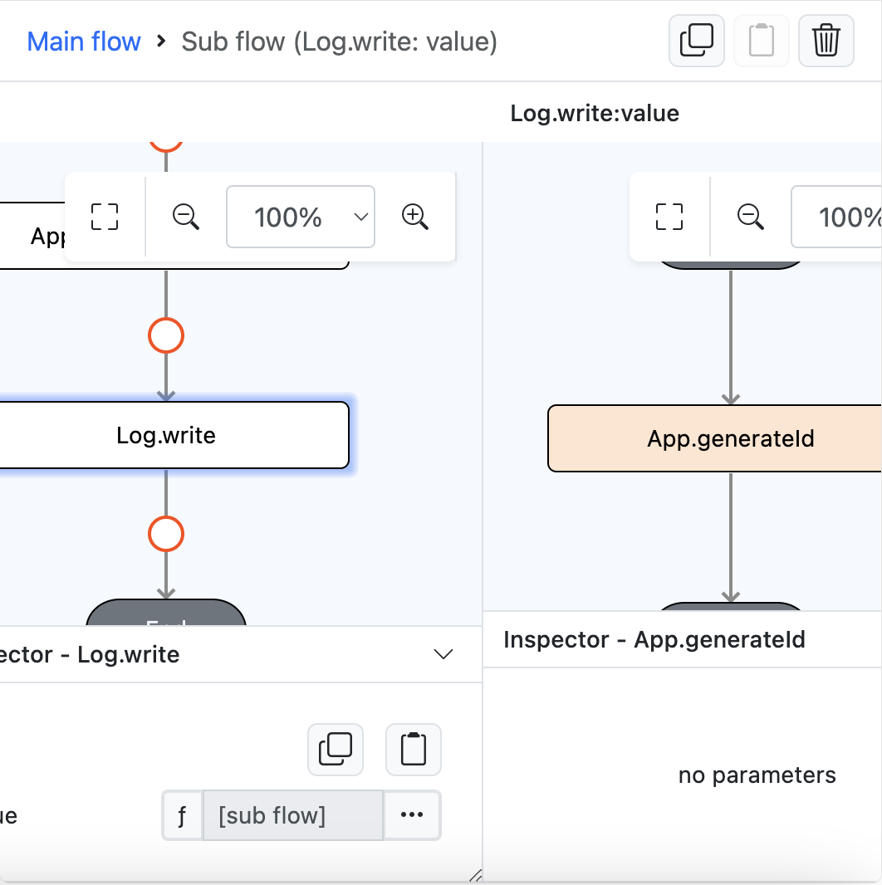
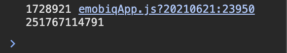

# App.generateId

## Description

Generates a unique number.

## Input

N/A

## Output

| Description | Output Type |
| ------ | ------ |
| Returns generated number.| Number |

### Steps

1. Drag a button component to a page in the mobile designer, select the event `press` and drag the `Log.write` function to the event flow and select function as the parameter type. Drag `App.generateId` function inside the `Log.write` sub flow

    

        
    

### Result

1. Check the preview console, it will show the generated number from `App.generateId` function.

    

        
    
