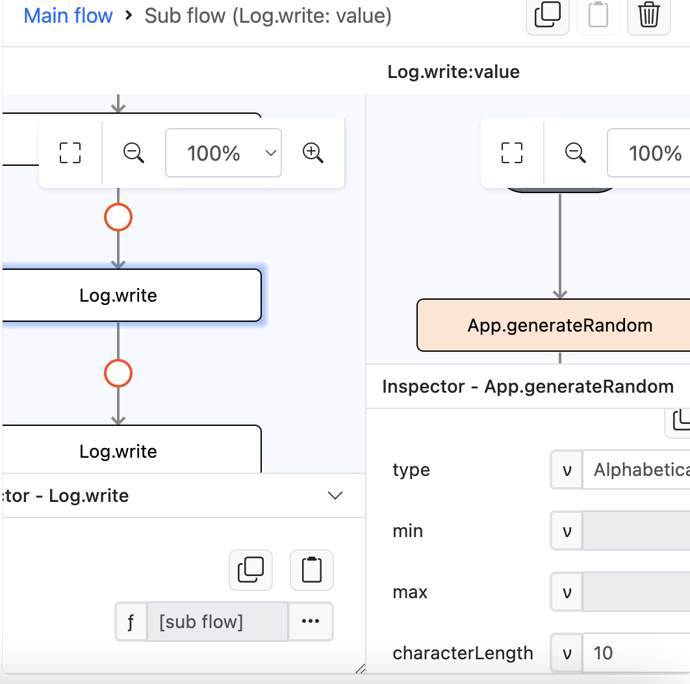
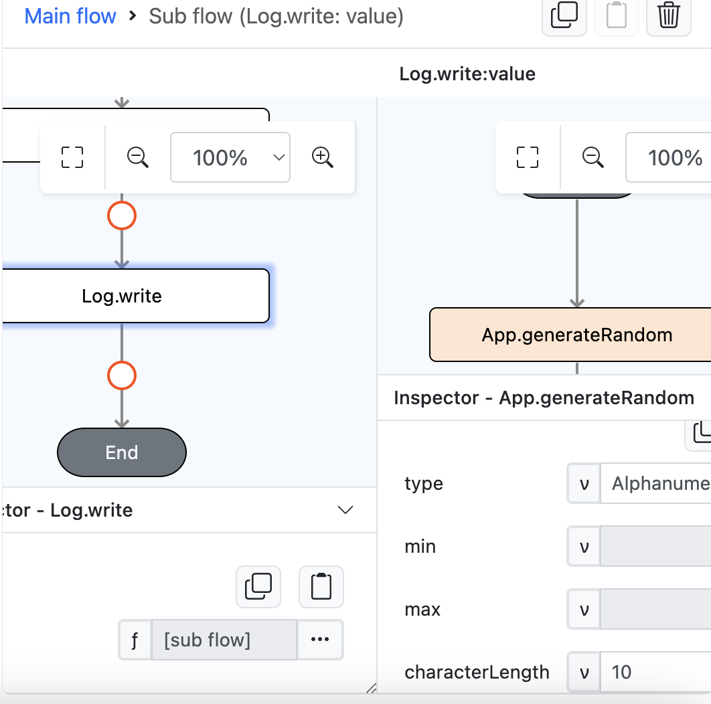
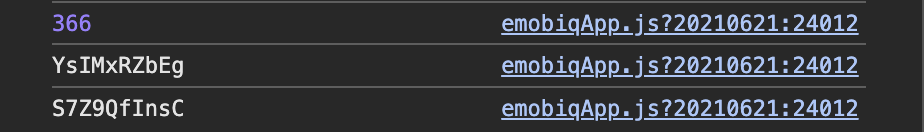

# App.generateRandom

## Description

Generates random number, alphabetical or alphanumeric string. 

## Input

| Name | Description | Input Type | Default | Options | Required |
| ------ | ------ | ------ | ------ | ------ | ------ |
| type | The type of value to generate. | String/Text | - | Number, Alphabetical, Alphanumeric | Yes |
| min | The min number that can be generated. Applicable for type “Number” only. | Number | - | - | Yes (“Number” only) |
| max | The max number that can be generated. Applicable for type “Number” only. | Number | - | - | Yes (“Number” only) |
| characterLength | The length of the string to generate. Applicable for type “Alphabetical” and “Alphanumeric” only. | Number | - | - | Yes (“Alphabetical” and “Alphanumeric” only) |

## Output

| Description | Output Type |
| ------ | ------ |
| Returns the number or text generated.  | Number/Text |

### Steps

1. Drag a button component to a page in the mobile designer, select the event `press` and drag the `Log.write` function to the event flow and select function as the parameter type. Drag `App.generateRandom` function inside the `Log.write` sub flow. On param `type` add value `Number` and on param `min` add value `1` and on param `max` add value `777`.

    

        
    

2. Drag the `Log.write` function to the event flow and select function as the parameter type. Drag `App.generateRandom` function inside the `Log.write` sub flow. On param `type` add value `“Alphabetical”` and on param `characterLength` add value `10`.

    

        
    

2. Drag the `Log.write` function to the event flow and select function as the parameter type. Drag `App.generateRandom` function inside the `Log.write` sub flow. On param `type` add value `Alphanumeric` and on param `characterLength` add value `10`.

    

        
    

### Result

1. Check the preview console, it will show the generated text/number from `App.generateRandom` function.

    

        
    
