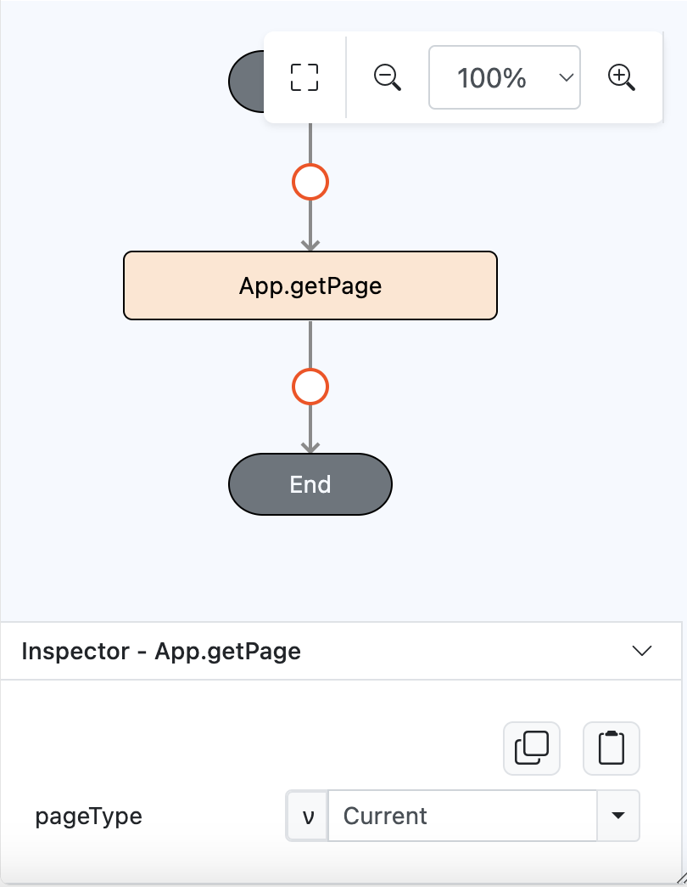
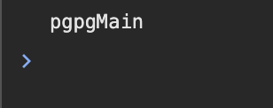

# App.getPage

## Description

Retrieves page details based on the specified page type.

## Input / Parameter

| Name | Description | Input Type | Default | Options | Required |
| ------ | ------ | ------ | ------ | ------ | ------ |
| pageType | The type of the page to retrieve (e.g., `Current` - get the current page name, `Previous` - get the previous page name). | Text | - | - | Yes |

## Output

| Description | Output Type |
| ------ | ------ |
| Returns the page name. | Text |

## Example

In this example, we will retrieve the name of a specific page based on the `pageType` parameter.

### Steps

1. Drag a button component to a page in the mobile designer.

    

        
    

2. Select the event `press` and drag the `Log.write` function to the event flow and select function as the parameter type.
3. Drag `App.getPage` function inside the `Log.write` sub flow and fill in the parameter. For the `pageType` parameter, you can set as Current or Previous page.

    

        
    

### Result

1. The result will be the name of Current/Previous page.
    

        
    
