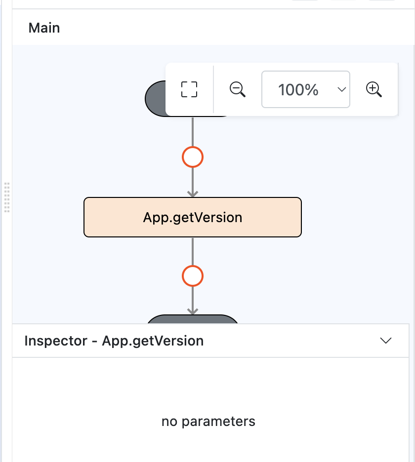

# App.getVersion

## Description

Fetches the current version of the application.

## Input / Parameter

This function does not require any input parameters.

## Output

| Description | Output Type |
| ------ | ------ |
| Returns the application version information. | Object |

### Steps

1. Drag App.getVersion function to event flow.

    

        
    

### Result

1. In built app: the format for android will be: version, e.g: 0.0.0, for ios will be: version-applicationBuildType, e.g: 0.0.0-release