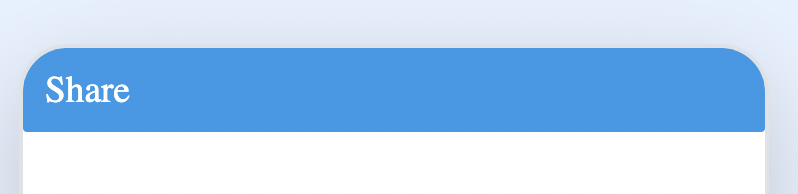

# App.share

## Description

Shares content via a sharing mechanism (e.g., social media, email) with specified subject, message, URL, and files.

## Input / Parameter

| Name    | Description                                                          | Input Type | Default | Options | Required |
| ------- | -------------------------------------------------------------------- | ---------- | ------- | ------- | -------- |
| subject | The subject line of the share message.                               | Text       | -       | -       | No      |
| message | The message content to be shared.                                    | Text       | -       | -       | No      |
| url     | A URL to be included in the shared content.                         | Text       | -       | -       | Yes      |
| files   | A list of files to be shared along with the message.                | List       | -       | -       | Yes       |

## Output

| Description                                    | Output Type |
| ---------------------------------------------- | ----------- |
| Returns the status of the sharing operation.   | Object      |

## Callback

### callback

The action performed if this function runs successfully.

| Description                                 | Output Type |
| ------------------------------------------- | ----------- |
| Returns a confirmation of the share action. | Object      |

### errorCallback

The action performed if this function does not run successfully.

| Description                              | Output Type |
| ---------------------------------------- | ----------- |
| Returns an error message.                | Text       |

## Example

In this example, we will share a message with a subject and a URL when a button is pressed.

### Steps

1. Drag a `Button` component into the service page that will trigger the sharing action.

    

        
    

2. Select the event `press` for the button and drag the `App.share` function to the event flow. Fill in the parameters: subject, message, url and files.

    

        
    

     

        
    

### Result

1. Upon pressing the button, the specified subject, message, URL, and Files will be shared through the appropriate sharing mechanism.