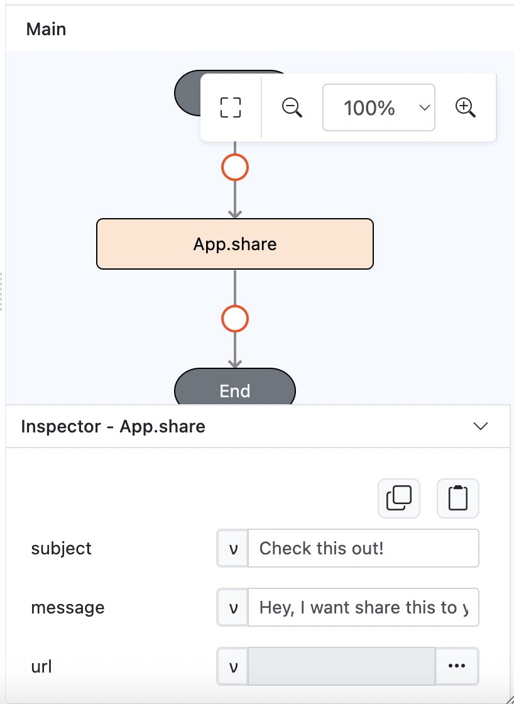

# App.share

## Description

Shares content via a sharing mechanism (e.g., social media, email) with specified subject, message, and files.

## Input / Parameter

| Name    | Description                                                           | Input Type | Default | Options | Required |
| ------- | --------------------------------------------------------------------- | ---------- | ------- | ------- | -------- |
| subject | The subject line of the share message.                                | Text       | -       | -       | No       |
| message | The message content to be shared.                                     | Text       | -       | -       | No       |
| url     | The url to be shared. (Web Link, Http/Https)                          | Text/List  | -       | -       | Yes      |
| files   | The files to be shared. (FilePath, Base64)                            | Text/List  | -       | -       | Yes      |

## Output

| Description                                    | Output Type |
| ---------------------------------------------- | ----------- |
| Returns the status of the sharing operation.   | Object      |

## Callback

### callback

The action performed if this function runs successfully.

| Description                                 | Output Type |
| ------------------------------------------- | ----------- |
| Returns a confirmation of the share action. | Object      |

### errorCallback

The action performed if this function does not run successfully.

| Description                              | Output Type |
| ---------------------------------------- | ----------- |
| Returns an error message.                | Text       |

## Example

In this example, we will share an image in base64 format and set the name as background_box.jpg and the url data will be:

`data:image/png;base64,iVBORw0KGgoAAAANSUhEUgAAAQAAAAEACAIAAADTED8xAAADMElEQVR4nOzVwQnAIBQFQYXff81RUkQCOyDj1YOPnbXWPmeTRef+/3O/OyBjzh3CD95BfqICMK0CMK0CMK0CMK0CMK0CMK0CMK0CMK0CMK0CMK0CMK0CMK0CMK0CMK0CMK0CMK0CMK0CMK0CMK0CMK0CMK0CMK0CMK0CMK0CMK0CMK0CMK0CMK0CMK0CMK0CMK0CMK0CMK0CMK0CMK0CMK0CMK0CMK0CMK0CMK0CMK0CMK0CMK0CMK0CMK0CMK0CMK0CMK0CMK0CMK0CMK0CMK0CMK0CMK0CMK0CMK0CMK0CMK0CMK0CMK0CMK0CMK0CMK0CMK0CMK0CMK0CMK0CMK0CMK0CMK0CMK0CMK0CMK0CMK0CMK0CMK0CMK0CMK0CMK0CMK0CMK0CMK0CMK0CMK0CMK0CMK0CMK0CMK0CMK0CMK0CMK0CMK0CMK0CMK0CMK0CMK0CMK0CMK0CMK0CMK0CMK0CMK0CMK0CMK0CMK0CMK0CMK0CMK0CMK0CMK0CMK0CMK0CMK0CMK0CMK0CMK0CMK0CMK0CMK0CMK0CMK0CMK0CMK0CMK0CMK0CMK0CMK0CMK0CMK0CMK0CMK0CMK0CMK0CMK0CMK0CMK0CMK0CMK0CMK0CMK0CMK0CMK0CMK0CMK0CMK0CMK0CMK0CMK0CMK0CMK0CMK0CMK0CMK0CMK0CMK0CMK0CMK0CMK0CMK0CMK0CMK0CMK0CMK0CMK0CMK0CMK0CMK0CMK0CMK0CMK0CMK0CMK0CMK0CMK0CMK0CMK0CMK0CMK0CMK0CMK0CMK0CMK0CMK0CMK0CMK0CMK0CMK0CMK0CMK0CMK0CMK0CMK0CMK0CMK0CMK0CMK0CMK0CMK0CMK0CMK0CMK0CMK0CMK0CMK0CMK0CMK0CMK0CMK0CMK0CMK0CMK0CMK0CMK0CMK0CMK0CMK0CMK0CMK0CMK0CMK0CMK0CMK0CMK0CMK0CMK0CMK0CMK0CMK0CMK0CMK0CMK0CMK0CMK0CMK0CMK0CMK0CMK0CMK0CMK0CMK0CMK0CMK0CMK0CMK0CMK0CMK0CMK0CMK0CMK0CMK0CMK0CMK0CMO0TAAD//2Anhf4QtqobAAAAAElFTkSuQmCC`

### Steps

1. Drag a `Button` component into the service page that will trigger the sharing action.

    

        
    

2. Select the event `press` for the button and drag the `App.share` function to the event flow. Fill in the parameters: subject, message, url and files.
   
    

        
    

3. For the url param, we need to change the param type to function and use `Conversion.toList` to convert data to array.
   
    

        
    

4. For the files param, we need to change the param type to function and use `Conversion.toList` to convert data to array.
   
    

        
    

### Result

1. Upon pressing the button, it will shows sharing mechanism based on data that you shared. For this example we share an image based on base64 format.
   
    

        
    

    

        
    
