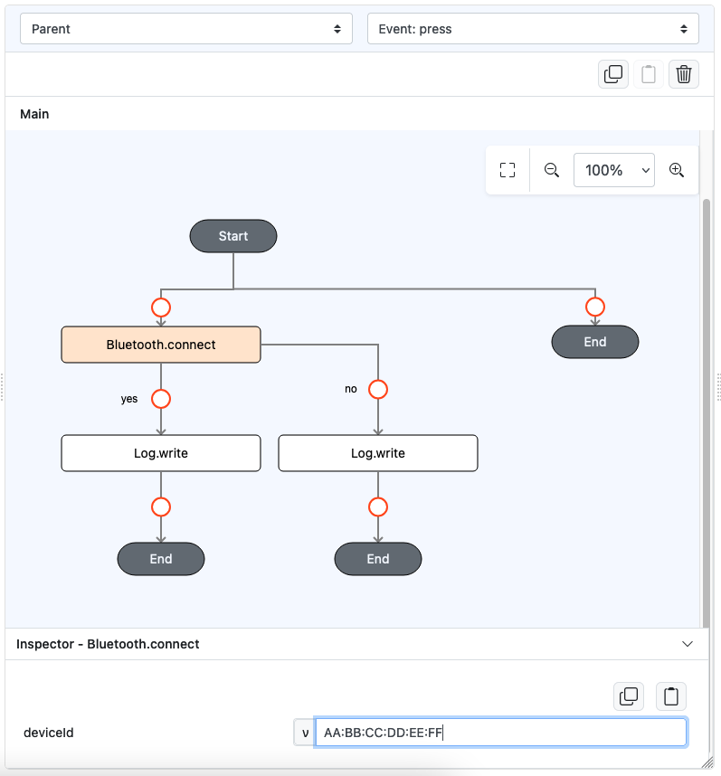

# Bluetooth.connect

## Description

Connects to a Bluetooth device.

## Input / Parameter

| Name     | Description                                           | Input Type | Default | Options | Required |
|----------|-------------------------------------------------------|------------|---------|---------|----------|
| deviceId | The ID of the printer to connect to.                  | Text       | -       | -       | Yes      |
| extra    | The stored value that is passed to all the callbacks. | Any        | -       | -       | No       |

## Output

| Description                        | Output Type |
|------------------------------------|-------------|
| Returns the formatted information. | Object      |

## Example

In this example, we will attempt to connect to a Bluetooth devices

### Steps

1. Drag a `button` component into the canvas and open the `Action` tab. Select the `press` event of the button.
2. Add `Bluetooth.connect` function, filling up the necessary parameter.
    - You may obtain ID of the device you want to connect by using `Bluetooth.getList`
3. Continue to add `Log.write` just under the function, for each of the callbacks available, that is YES (`callback`) and NO (`errorCallback`)

    

        
    

### Result

1. When running the app on Android device, connect it to a computer, and run `adb logcat` on the terminal on that computer
2. Trigger the button press, and observe the output produced by `Log.write` on the terminal.
3. The output will show `true` if the operation is successful, or an error message otherwise.

## Links

### Related Information
