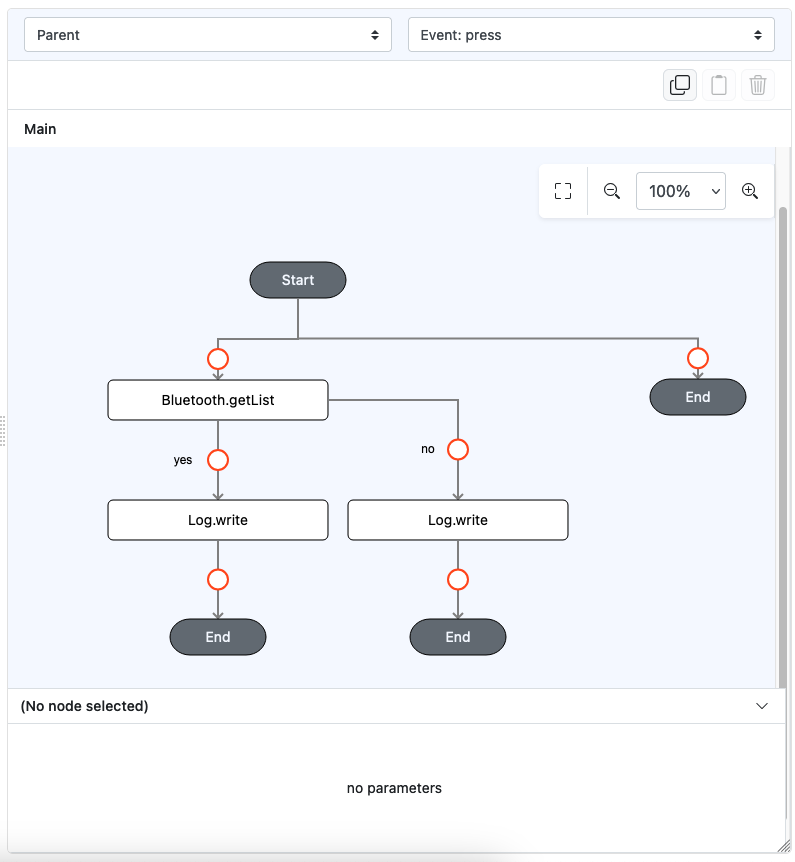

# Bluetooth.getList

## Description

Returns a list of all the Bluetooth devices.

## Input / Parameter

N/A

## Output

| Description                        | Output Type |
|------------------------------------|-------------|
| Returns the formatted information. | Object      |

## Example

In this example, we will attempt to retrieve the list of Bluetooth devices

### Steps

1. Drag a `button` component into the canvas and open the `Action` tab. Select the `press` event of the button.
2. Add `Bluetooth.getList` function.
3. Continue to add `Log.write` just under the function, for each of the callbacks available, that is YES (`callback`) and NO (`errorCallback`)
 
    <div style="display:flex; align-items:center; justify-content:center; background-color: #E7F1FF;">
        
    </div>

### Result

1. When running the app on Android device, connect it to a computer, and run `adb logcat` on the terminal on that computer
2. Trigger the button press, and observe the output produced by `Log.write` on the terminal.
3. The output will show up according to the structure similar to below.
```json
[
  {"name":"Wireless earphone","id":"30:53:C1:XX:XX:XX","address":"30:53:C1:XX:XX:XX","class":7936},
  {"name":"Smartphone","id":"D8:B0:53:XX:XX:XX","address":"D8:B0:53:XX:XX:XX","class":524}
]
```

## Extra notes
1. Bluetooth must be activated before executing this function. An error will be returned otherwise.
2. Only paired devices will be listed. Be sure to pair the target Bluetooth device first according to system settings on the host device

## Links

### Related Information
