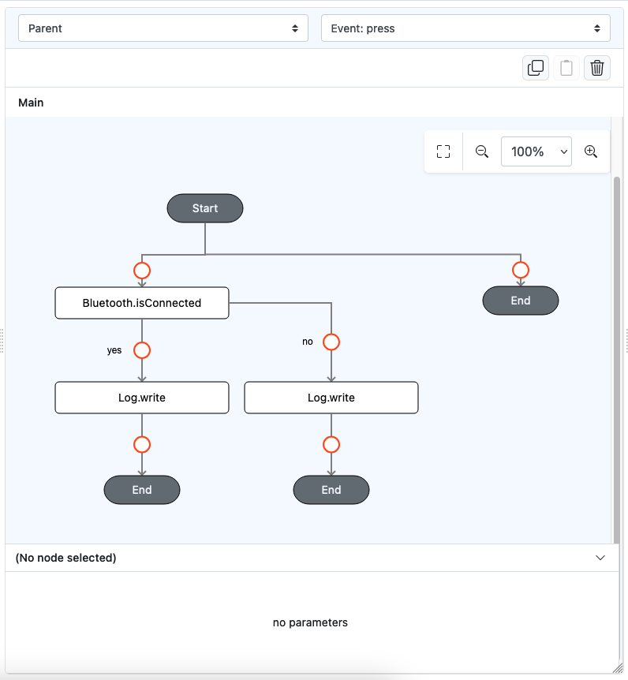

# Bluetooth.isConnected

## Description

Checks whether a Bluetooth device is connected to the user’s device.

## Input / Parameter

N/A

## Output

| Description                        | Output Type |
|------------------------------------|-------------|
| Returns the formatted information. | Object      |

## Example

In this example, we will attempt to check the connectivity of the currently active Bluetooth device.
0e sure to connect it first using `Bluetooth.connect`

### Steps

1. Drag a `button` component into the canvas and open the `Action` tab. Select the `press` event of the button.
2. Add `Bluetooth.isConnected` function.
3. Continue to add `Log.write` just under the function, for each of the callbacks available, that is YES (`callback`) and NO (`errorCallback`)

    

        
    

### Result

1. When running the app on Android device, connect it to a computer, and run `adb logcat` on the terminal on that computer
2. Trigger the button press, and observe the output produced by `Log.write` on the terminal.
3. The output will show `true` if the device is connected, or an error message otherwise.

## Links

### Related Information
