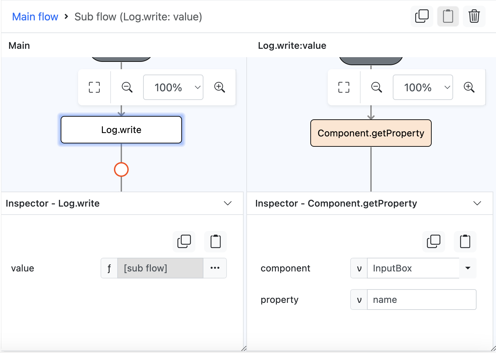

# Component.getProperty

## Description

Returns the attribute of a component, such as its name, dimensions etc.

## Input / Parameter

| Name | Description | Input Type | Default | Options | Required |
| ------ | ------ | ------ | ------ | ------ | ------ |
| component | The name of the component to get property from. | String/Text | - | - | Yes |
| property | The attribute of the component. | String/Text | - | - | Yes |

## Output

| Description | Output Type |
| ------ | ------ |
| Returns the property of the component. | String/Text |

## Example

In this example, we will get the name attribute of an input box component using `Component.getProperty` and print it to the console. 

### Steps

1. First we drag an input box onto the page. We will name it "InputBox" with the value "This is an input field".

    

        
    

2. We want to get the 'name' attribute of "InputBox" and display it in the browser console with the help of the `Log.write` helper function. 
3. Drag `Component.getProperty` into the event flow, and specify the name of the component, which in this case is "InputBox".

    

        
    

### Result

1. The `name` attribute of "InputBox" will be displayed in the browser console.

    

        
    

## Links

### Related Information

See also:

 - Functions
    - [Component.setProperty](/document/client/gitbook/2-5-actions-and-visual-logic/action-reference/react-native/Component/setProperty/)