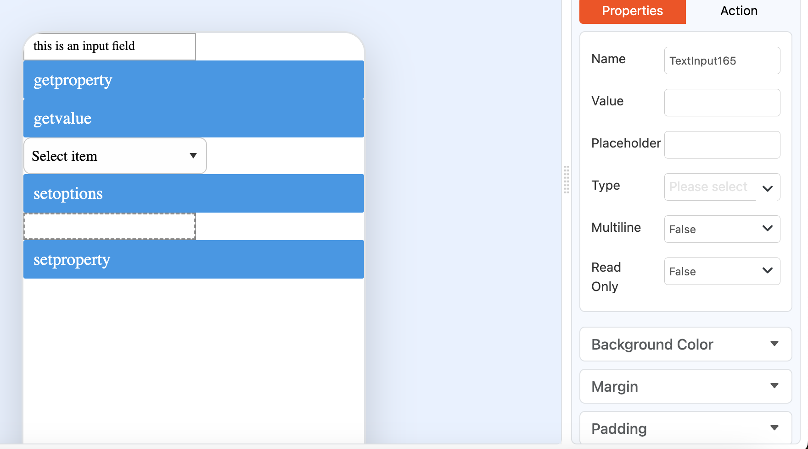
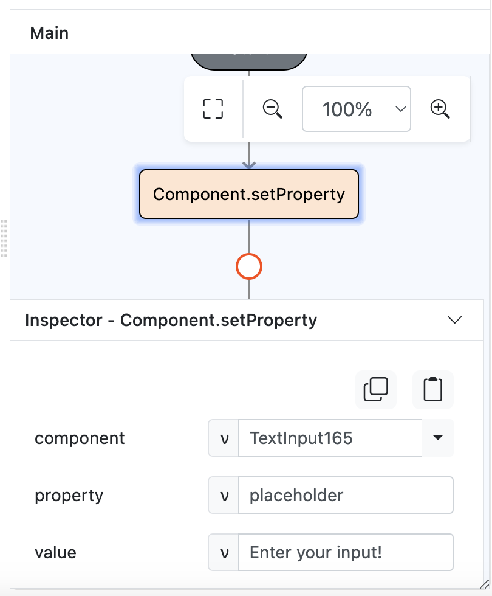
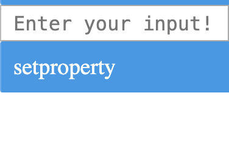

# Component.setProperty

## Description

Allows users to set a property of a component.

## Input / Parameter

| Name | Description | Input Type | Default | Options | Required |
| ------ | ------ | ------ | ------ | ------ | ------ |
| component | The name of the component. | String/Text | - | - | Yes |
| property | The attribute to be set for the component. | String/Text | - | - | Yes |
| value | The value of the property to be set for the component. | String/Text | - | - | Yes |

## Output

Note: The component will be updated to show the value that has been set to it.

## Example

In this example, we will set the placeholder attribute of the text input component, where once the button is clicked the text input component will show a placeholder that says "Enter your input!" 

### Steps

1. First, we drag a button and a text input onto the canvas.
2. Select the button and under the 'Actions' tab, drag the `Component.setProperty` into the flow for the button. 

    

        
    

3. Under the inspector for this function, select the component whose property you would be changing, which in this example is `TextInput165`.
4. Enter the property to change and the value of the property to display. 

    

        
    

### Result

1. Save and preview your app. 
2. Now when you click the button, it will set the placeholder attribute of the text input component to 'Enter your input!'

    

        
    

## Links 

### Related Information

See also:

- Functions
    - [Component.getProperty](/document/client/gitbook/2-5-actions-and-visual-logic/action-reference/react-native/Component/getProperty/getProperty.md)