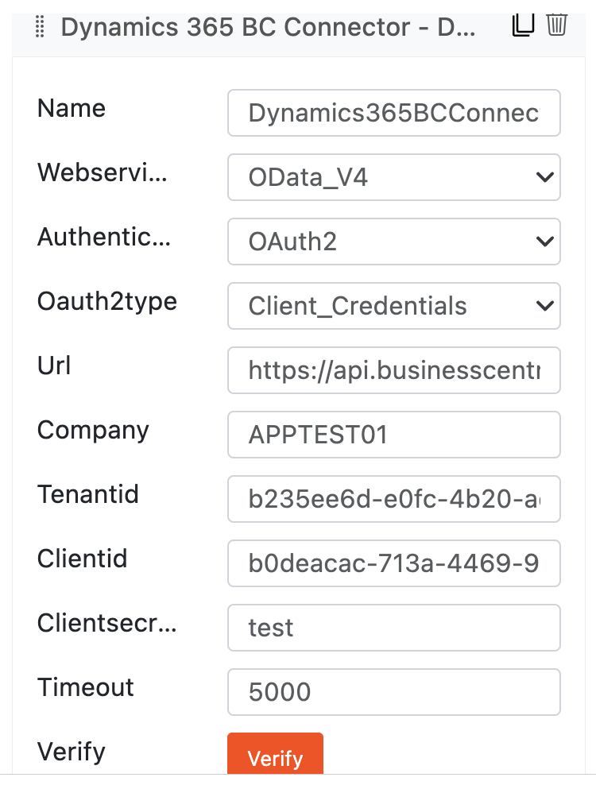
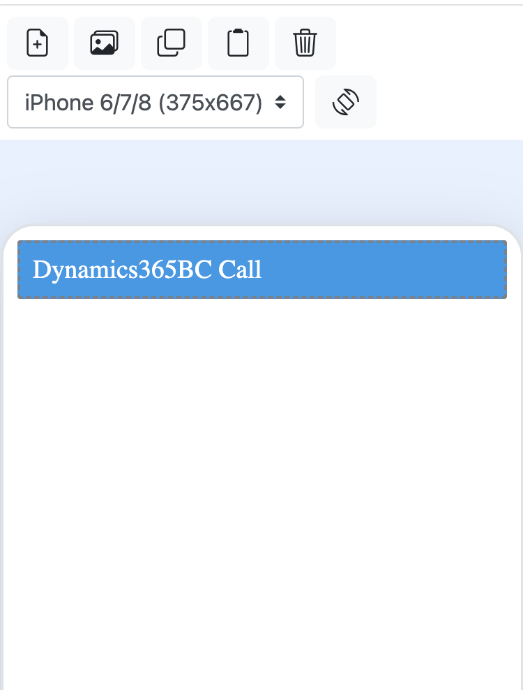
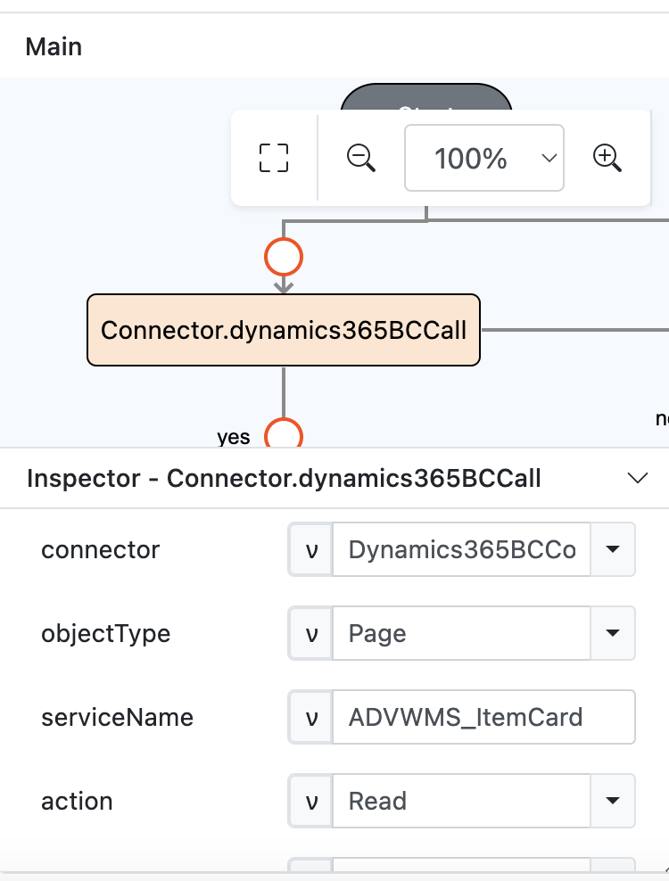
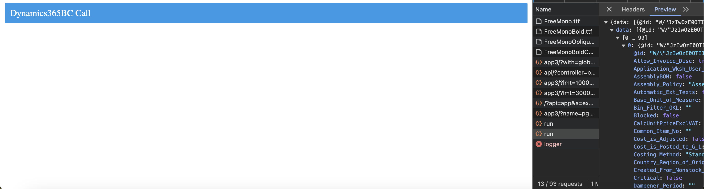

# Connector.dynamics365BCCall

## Description

Performs a dynamics365BCCall call using a Dynamics 365BC Connector.

## Input / Parameter

| Name | Description | Input Type | Default | Options | Required |
| ------ | ------ | ------ | ------ | ------ | ------ |
| connector | The Dynamics 365BC Connector to be used. | Text  | - | - | Yes |
| objectType | The object to perform the action on | Text | - | Page, Codeunit, Query | No |
| serviceName | The name of the service to perform the action on. | Text | - | - | No |
| action | The action to be performed. | Text | - | - | No |
| multiple | To perform multiple actions or not. This only applies to object type ‘Page’. | Boolean | false | true, false | No |
| data | Request body, define what the action to be performed should do. | Object | - | - | No |
| extra | The stored value that is passed to all the callbacks. | Any | - | - | No |

### data (Object)

Request body, define what the action to be performed should do. Will contain a single object which consist of:

| Key | Description | Input Type | Required |
| ------ | ------ | ------ | ------ |
| name | Request body name or key. | Text | Yes |
| value | Request body value. | Text | No |

## Output

| Description | Output Type |
| ------ | ------ |
| Returns the formatted information. | Object |

### Object

| Key | Description | Output Type |
| ------ | ------ | ------ |
| success | Boolean value to denote whether the function was executed successfully. | Text |
| message | The message to print. | Text |
| data | Any additional message or data to print. | Text |

## Callback

### callback

The action performed if this function runs successfully.

| Description | Output Type |
| ------ | ------ |
| Returns an object with the information of the API call. | Object |

#### Object

| Key | Description | Output Type |
| ------ | ------ | ------ |
| success | The flag to determine of tha API call is successful or not | Boolean |
| data | The result of the API call. | Object |

### errorCallback

The action performed if this function runs successfully.

| Description | Output Type |
| ------ | ------ |
| Returns an object with the information of the API call. | Object |

#### Object

| Key | Description | Output Type |
| ------ | ------ | ------ |
| success | The flag to determine of tha API call is successful or not | Boolean |
| error | The error message for unsuccessful API call. | Text |

## Example

In this example, we will create a connection using the dynamics365BCCall function. 

### Steps

1. Drag a `Dynamics 365BC Connector` component into the services panel in the Services page and fill the fields, don't forget to click the `Verify` button to check your account validity.

    

        
    

2. Drag a button component to a page in the mobile designer.
    
    

        
    

3. Select the event `press` and drag the `Connector.dynamics365BCCall` function to the event flow and fill in the parameter.

    

        
    

4. Open the preview and try to press the Button, the dynamics365BCCall api call should be visibile on the inspector network tab.

    

        
    

### Result

The information of the API call should be returned.