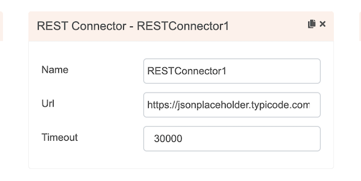
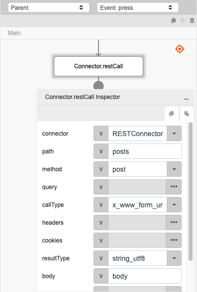
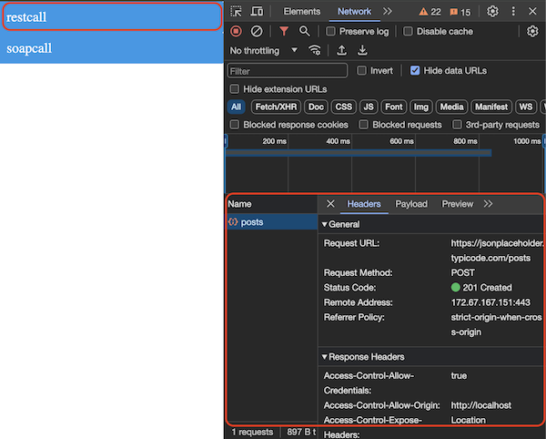

# Connector.restCall

## Description

Performs a rest API call using a Rest Connector.

## Input / Parameter

| Name | Description | Input Type | Default | Options | Required |
| ------ | ------ | ------ | ------ | ------ | ------ |
| connector | The Rest Connector to be used. | Text  | - | - | Yes |
| path | The additional path to append to the connector's url. | Text | - | - | No |
| method | The http request method. | Text | Get | Get, Patch, Put, Post, Delete, Head, Options | No |
| query | The query string for the endpoint. | Object | - | - | No |
| callType | The content type of the API. | Text | Raw | Form_Data, X_WWW_Form_URL_Encoded, Raw, Binary, JSON | No |
| headers | The query string for the endpoint. | Object | - | - | No |
| cookies | The cookies of the API call. | Object / List | - | - | No |
| resultType | The preferred result to return. | Text | String_UTF8 | String_UTF8, Byte_Array | No |
| body | The body to pass along in the call. | Object / Text | - | - | No |
| attachment | The path to the selected file. | Object / List | - | - | No |
| extra | The stored value that is passed to all the callbacks. | Any | - | - | No |

### cookies (Object | List)

Cookies of the API call. Will contain a single object, or a list of one (1) or more objects which consist of:

| Key | Description | Input Type | Required |
| ------ | ------ | ------ | ------ |
| name | Name of the cookie. | Text | No |
| value | Contains the value of the cookie. | Text | Yes |

### attachment (Object | List)

The path to the selected file. Will contain a single object, or a list of one (1) or more objects which consist of:

| Key | Description | Input Type | Required |
| ------ | ------ | ------ | ------ |
| name | Optional name. If not specified, file name will be used. | Text | No |
| value | Contains the direct file path of the attachments. | Text | Yes |

## Output

| Description | Output Type |
| ------ | ------ |
| Returns the formatted information. | Object |

### Object

| Key | Description | Output Type |
| ------ | ------ | ------ |
| success | Boolean value to denote whether the function was executed successfully. | Text |
| message | The message to print. | Text |
| data | Any additional message or data to print. | Text |

## Callback

### callback

The action performed if this function runs successfully.

| Description | Output Type |
| ------ | ------ |
| Returns an object with the information of the API call. | Object |

#### Object

| Key | Description | Output Type |
| ------ | ------ | ------ |
| statusCode | The status code of the API call. | Number |
| result | The result of the API call. | Text |
| cookies | The cookies of the API call. | Object |

### errorCallback

The action performed if this function runs successfully.

| Description | Output Type |
| ------ | ------ |
| Returns an object with the information of the API call. | Object |

#### Object

| Key | Description | Output Type |
| ------ | ------ | ------ |
| statusCode | The status code of the API call. | Number |
| errorMessage | The error message for unsuccessful API call. | Text |

## Example

In this example, we will create a connection using the restCall function. 

### Steps

1. Drag a `REST Connector` component into the services panel in the service page and then fill the fields.

    

        
    

2. Drag a button component to a page in the mobile designer.
    
    

        
    

3. Select the event `press` and drag the `Connector.restCall` function to the event flow and fill in the parameter.

    

        
    

4. Open the preview and try to press the Button, the rest api call should be visibile on the inspector network tab.

    

        
    

### Result

The information of the API call should be returned.