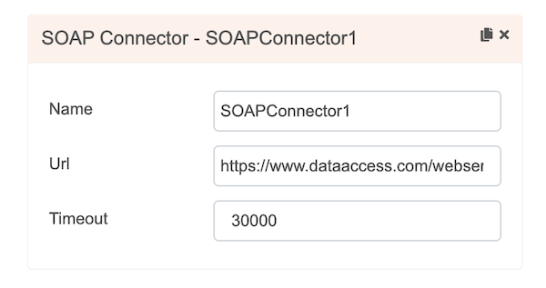
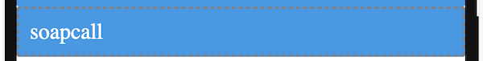
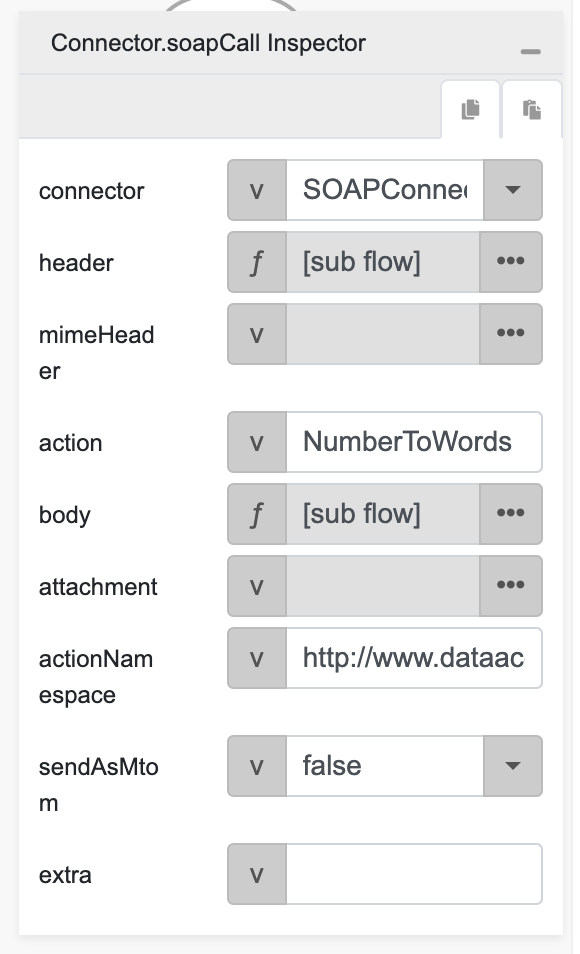
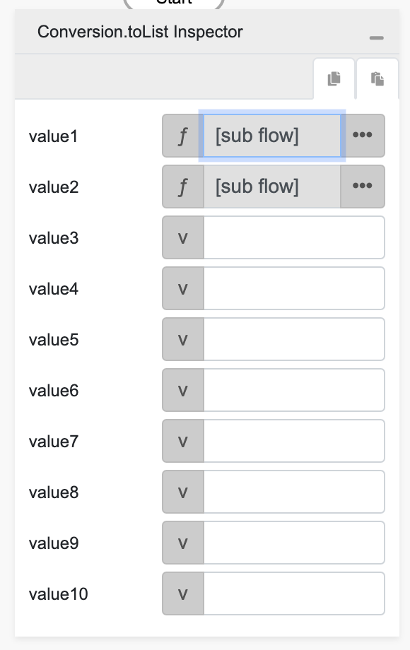
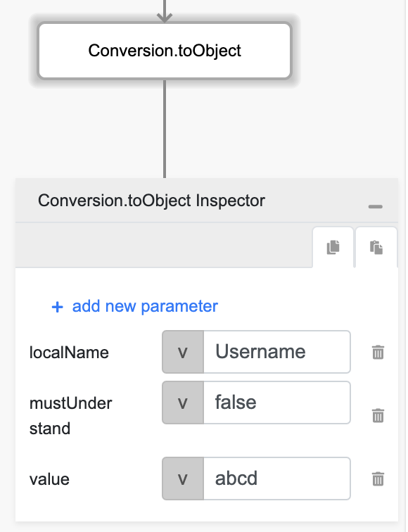
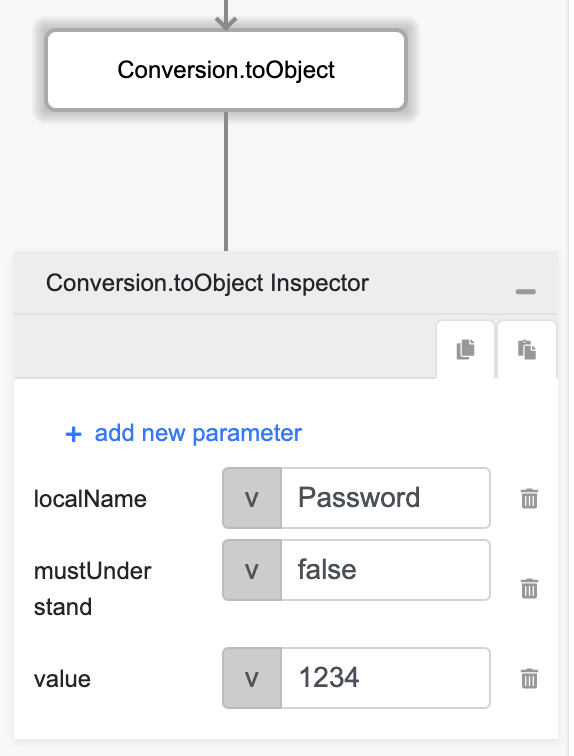
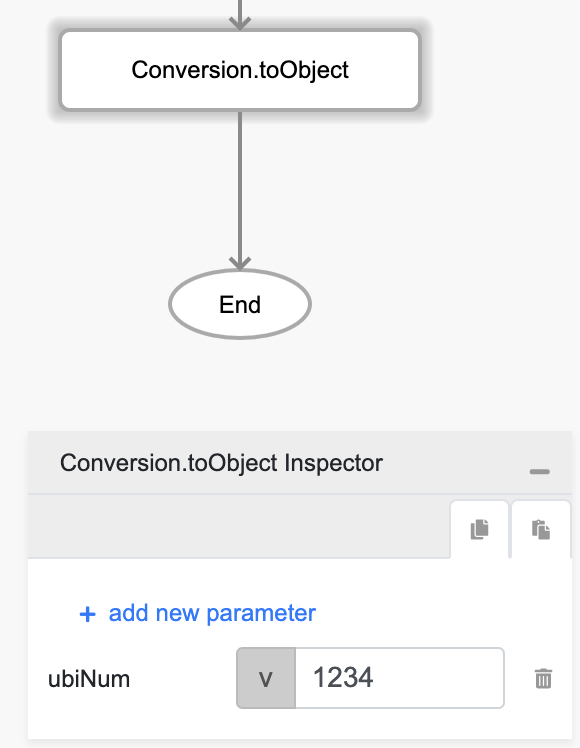
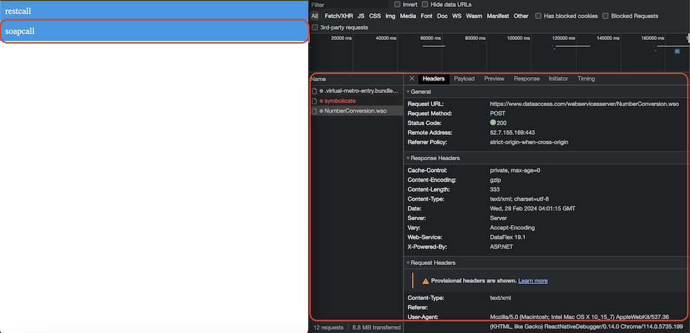

# Connector.soapCall

## Description

Performs a SOAP API call using a SOAP Connector.

## Input / Parameter

| Name | Description | Input Type | Default | Options | Required |
| ------ | ------ | ------ | ------ | ------ | ------ |
| connector | The Rest Connector to be used. | Text  | - | - | Yes |
| header | An object or a list of objects of the SOAP header that will contain arbitrary key-value pairs to be sent as part of the request. | Object / List | - | - | No |
| mimeHeader | The key-value pair of MIME headers (equivalent to HTTP headers) to be sent along with the request. | Object | - | - | No |
| action | The name of the SOAP action to be called. | Text | - | - | Yes |
| body | The content of the SOAP body. | Object | - | - | No |
| attachment | The map of the key to the file path for attaching files to upload along with the body. | Object / List | - | - | No |
| actionNamespace | The namespace of the SOAP action to be invoked. | Text | - | - | No |
| sendAsMtom | To enable or disable MOM support to send the request. | Boolean | false | true, false | No |
| extra | The stored value that is passed to all the callbacks. | Any | - | - | No |

### header (Object | List)

Will contain a single object, or a list of one (1) or more objects of the SOAP header which consist of key-value pairs to be sent as part of the request. The structure of the object should be:

| Key | Description | Input Type | Required |
| ------ | ------ | ------ | ------ |
| localName | Name of the root element. | Text | Yes |
| namespace | XML namespace for this header element. | Text | Yes |
| actor | Actor name/URI for this header element. (For SOAP 1.1) | Text | No |
| role | Role name/URL for this header element. (For SOAP 1.2) | Text | No |
| relay | Option to activate relay property in SOAP header. (For SOAP 1.2) | Boolean | No |
| mustUnderstand | Option to activate mustUnderstand property in SOAP header. | Boolean | No |
| value | Value for this header. Can be a single value (scalar), an object or a list of objects. Map keys prefixed with �_� will be treated as an attribute. | Any | No |

### attachment (Object | List)

Map of the key to the file path for attaching files to upload along with te body. Will contain a single object, or a list of one (1) or more objects which consist of:

| Key | Description | Input Type | Required |
| ------ | ------ | ------ | ------ |
| name | Optional name. If not specified, file name will be used. | Text | No |
| value | Contains the direct file path of the attachments. | Text | Yes |

## Output

| Description | Output Type |
| ------ | ------ |
| Returns the formatted information. | Object |

### Object

| Key | Description | Output Type |
| ------ | ------ | ------ |
| success | Boolean value to denote whether the function was executed successfully. | Text |
| message | The message to print. | Text |
| data | Any additional message or data to print. | Text |

## Callback

### callback

The action performed if this function runs successfully.

| Description | Output Type |
| ------ | ------ |
| Returns an object with the information of the SOAP call. | Object |

#### Object

| Key | Description | Output Type |
| ------ | ------ | ------ |
| value | The value returned after the function has been executed. | Object |

### errorCallback

The action performed if this function runs successfully.

| Description | Output Type |
| ------ | ------ |
| Returns an object with the information of the SOAP call. | Object |

#### Object

| Key | Description | Output Type |
| ------ | ------ | ------ |
| errorMessage | The error message for unsuccessful SOAP call. | Text |
| fault | The fault associated with the error. | Object |

## Example

In this example, we will create a connection using the soapCall function. 

### Steps

1. Drag a `SOAP Connector` component into the services panel in the service page and then fill the fields.

    

        
    

2. Drag a button component to a page in the mobile designer.

    

        
    

3. Select the event `press` and drag the `Connector.soapCall` function to the event flow and fill in the parameter.

    

        
    

4. For the `header` param change it's type to a function / subflow and put `Conversion.toList` inside it, and change `value1` and `value2` param type to a function / subflow.

    

        
    

5. For `value1` value put `Conversion.toObject` inside it then add `localName`, `mustUnderstand`, `value` as object key with `Username`, `false`, `abcd` as it's value respectively.

    

        
    

6. For `value2` value put `Conversion.toObject` inside it then add `localName`, `mustUnderstand`, `value` as object key with `Password`, `false`, `1234` as it's value respectively.

    

        
    

7. For the `body` param change it's type to a function / subflow and put `Conversion.toObject` inside it, and then add `ubiNum` as object key with `1234` as it's value.

    

        
    

8. Open the preview and try to press the Button, the soap call should be visibile on the inspector network tab.

    

        
    

### Result

The information of the SOAP call should be returned.