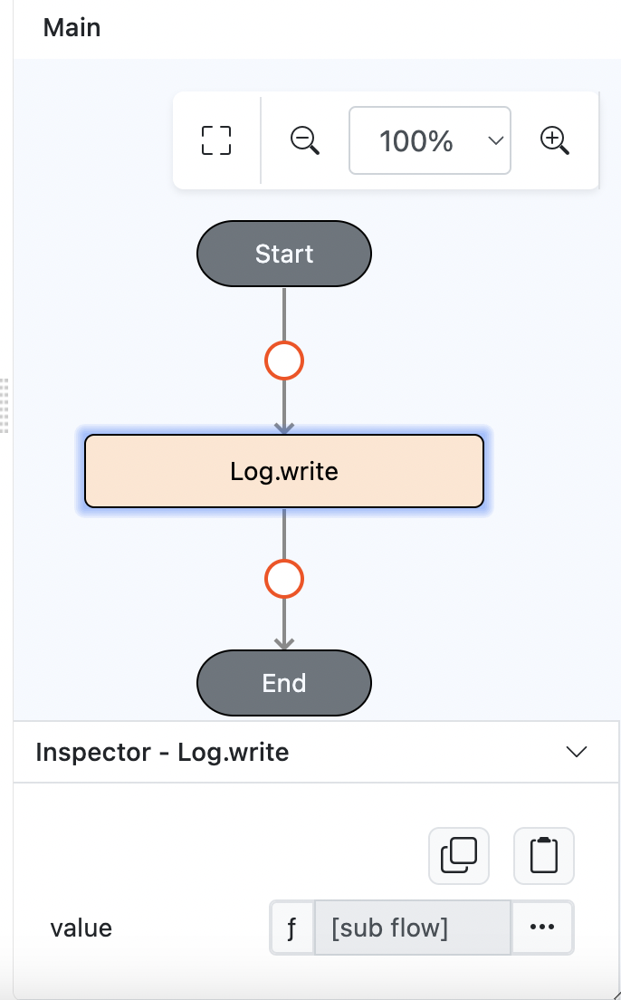

# Control.callback

## Description

Triggers a flow of actions.

## Input / Parameter

| Name   | Description                                           | Input Type | Default | Options | Required |
| ------ | ----------------------------------------------------- | ---------- | ------- | ------- | -------- |
| extra  | The stored value that is passed to all the callbacks. | Any        | -       | -       | No       |

## Output

| Description | Output Type |
| ------ | ------ |
| Returns the formatted information. | Object |

## Callback

### yesCallback

The functions to be executed.

## Example

In this example, we will put callback inside `Log.write` function.

### Steps

1. Drag a `button` component into the canvas and open the `Action` tab. Select the `press` event of the button and drag the `Log.write` function to the event flow.
    

        
    

2. Change the `Log.write` value into function.

    

        
    

3. Put `Control.callback` function inside and under yes callback, call `Log.write` or any function(s) that required to call.

    

        
    

### Result

1. The function will call yes callback(s) that specified under the `Control.callback` function.
    
    

        
    
