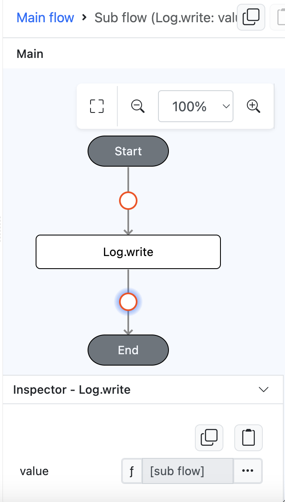
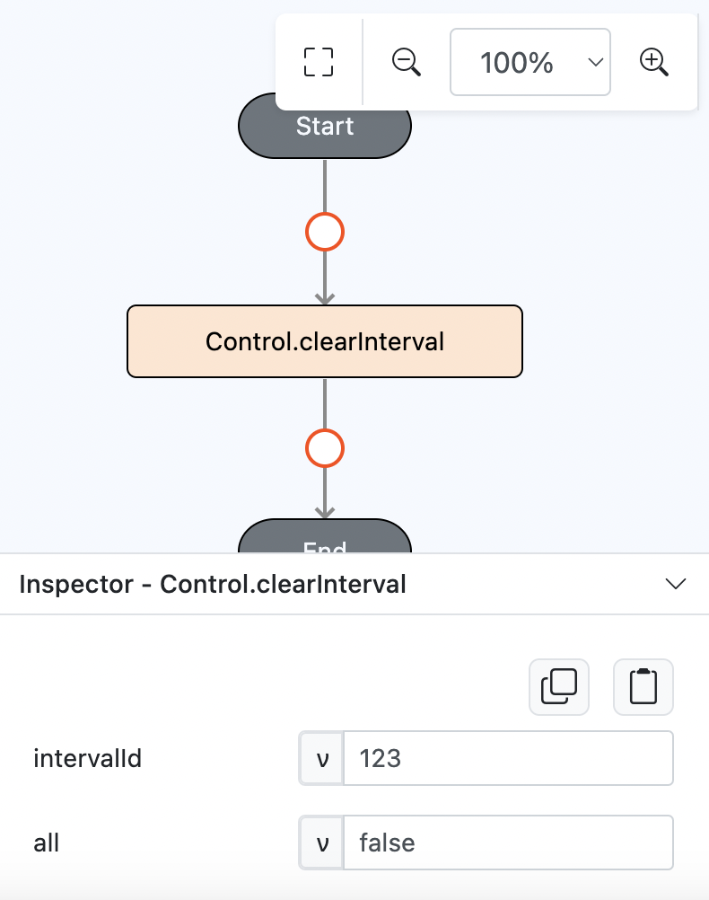
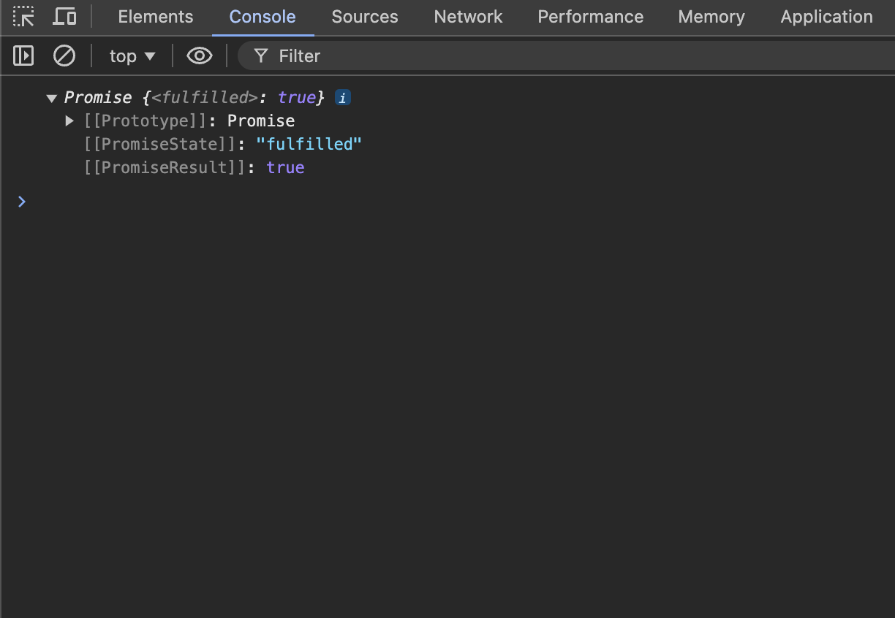

# Control.clearInterval

## Description

Clears existing interval(s).

## Input / Parameter

| Name       | Description                                                                    | Input Type | Default | Options | Required |
| ---------- | ------------------------------------------------------------------------------ | ---------- | ------- | ------- | -------- | 
| intervalId | The id of the interval to clear.                                               | Boolean    | -       | -       | Yes      |
| all        | To clear all intervals or not (only for interval with persistent equals false) | Boolean    | false   | false, true | No       |

## Output

Returns formatted information. 

## Example

In this example, we will clearInterval by interval id.

__\* Note:__ Must have working `Control.interval` function with it's interval id in order for this function to work.

### Steps

1. Drag a `button` component into the canvas and open the `Action` tab. Select the `press` event of the button and drag the `Control.clearInterval` function to the event flow.
   
    

        
    

2. Put a `Log.write` function inside the event flow and change the param type to function.
   
    

        
    

3. Put function `Control.clearInterval` inside `Log.write` function. Enter the parameters of the `Control.clearInterval` function.

    

        
    

### Result

1. The function will clear interval that has '123' as the id and this example will return true upon clearing.
   
    

        
    
