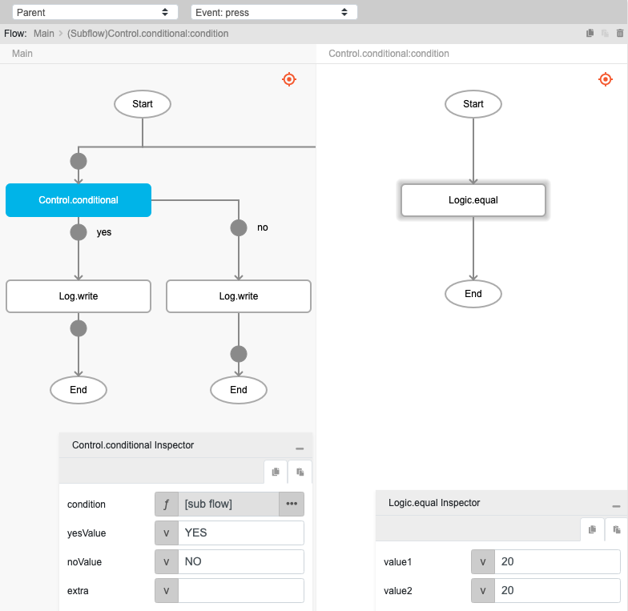
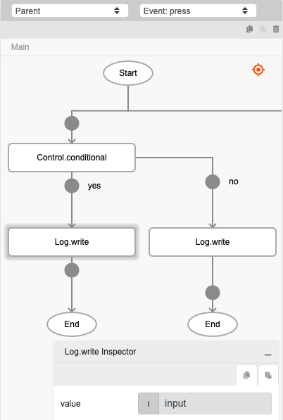

# Control.conditional

## Description

Validates the condition passed.

## Input / Parameter

| Name | Description | Input Type | Default | Options | Required |
| ------ | ------ | ------ | ------ | ------ | ------ |
| condition | The condition to be validated. | Boolean | false | - | No |
| yesValue | The output value if condition is 'true'. | Any | - | - | No |
| noValue | The output value if condition is 'false'. | Any | - | - | No |
| extra | The stored value that is passed to all the callbacks. | Any | - | - | No |

## Output

| Description | Output Type |
| ------ | ------ |
| Returns the 'yesValue' or 'noValue'. | Any |

## Callback

### yesCallback

The action performed if the condition is true.

### noCallback

The action performed if the condition is false.

## Example

In this example, we will pass a condition to check whether two values are equal using the `Logic.equal` function and print the result of the `Control.conditional` function in the console.

### Steps

1. Drag a `button` component into the canvas and open the `Action` tab. Select the `press` event of the button and drag the `Control.conditional` function to the event flow.
2. Call the function `Logic.equal` in the `condition` parameter of the function. Enter the parameters of the `Logic.equal` function.

    ```js
    value1: 20
    value2: 20
    ```
    <div style="display:flex; align-items:center; justify-content:center; background-color: #E7F1FF;">
        
    </div>

3. Call the function `Log.write` in both `yesCallback` and `noCallback` parameters of the `Control.conditional` function. Change the parameter type of the `value` parameter to `input`. 

    <div style="display:flex; align-items:center; justify-content:center; background-color: #E7F1FF;">
        
    </div>

### Result

1. The console will print `YES`.
