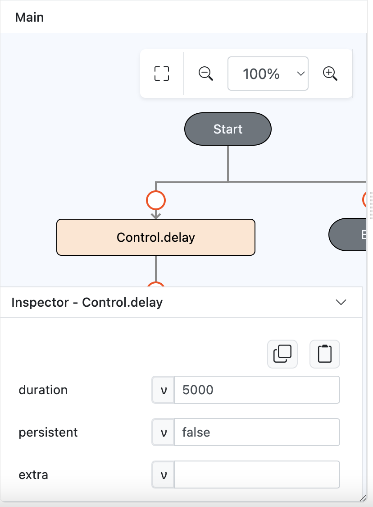

# Control.delay

## Description

Inserts a delay before executing another function.

## Input / Parameter

| Name | Description | Input Type | Default | Options | Required |
| ------ | ------ | ------ | ------ | ------ | ------ |
| duration | The time before a function is executed. (In milliseconds)  | Number | - | - | Yes |
| persistent | To still execute outside of the current page or not.  | Boolean | False | - | No |
| extra | The stored value that is passed to all the callbacks. | Any | - | - | No |

## Output

Will return true if executed.

## Callback

### yesCallback

The callback will return all functions under.

### Steps

1. Drag a `button` component into the canvas and open the `Action` tab. Select the `press` event of the button and drag the `Control.delay` function to the event flow.

    

        
    

2. Call the function `Logic.equal` in the `condition` parameter of the function. Enter the parameters of the `Logic.equal` function.

    

        
    

### Result
1. The function will return true if delay executed.
