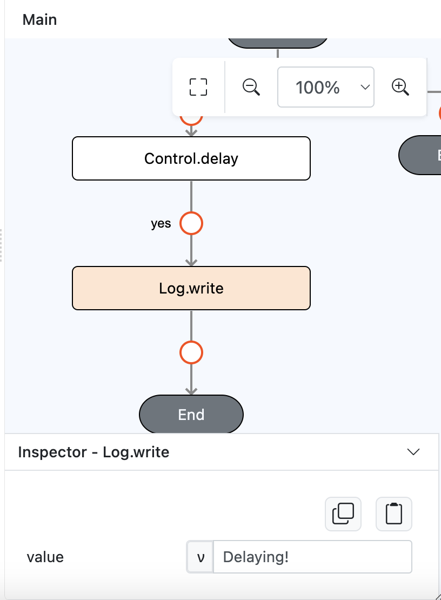
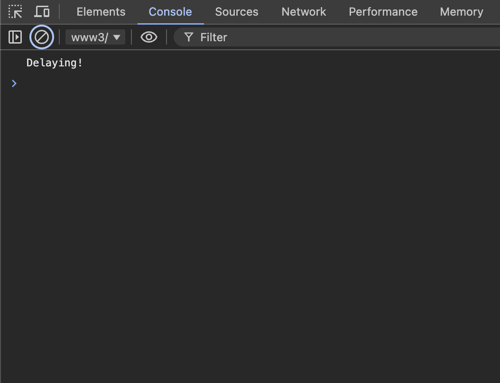

# Control.delay

## Description

Inserts a delay before executing another function.

## Input / Parameter

| Name       | Description                                                  | Input Type | Default | Options | Required |
| ---------- | ------------------------------------------------------------ | ---------- | ------- | ------- | -------- |
| duration   | The time before a function is executed. (In milliseconds)    | Number     | -       | -       | Yes      |
| persistent | To still execute outside of the current page or not.         | Boolean    | False   | False, True | No       |
| extra      | The stored value that is passed to all the callbacks.        | Any        | -       | -       | No       |

## Output

Returns formatted information. 

## Callback

### yesCallback

The callback will execute the function and returning boolean in input

## Example

In this example, We will put delay function to do `Log.write` message after 5 seconds.

### Steps

1. Drag a `button` component into the canvas and open the `Action` tab. Select the `press` event of the button and drag the `Control.delay` function to the event flow.

    

        
    

2. Call the function `Control.delay`. Enter the parameters of the `Control.delay` function.

    

        
    

3. Put `Log.write` below the `Control.delay`. Then put the value as "Delaying!".

    

        
    

### Result

1. The function will execute after 5 seconds. In this case to return "Delaying!".

    

        
    

