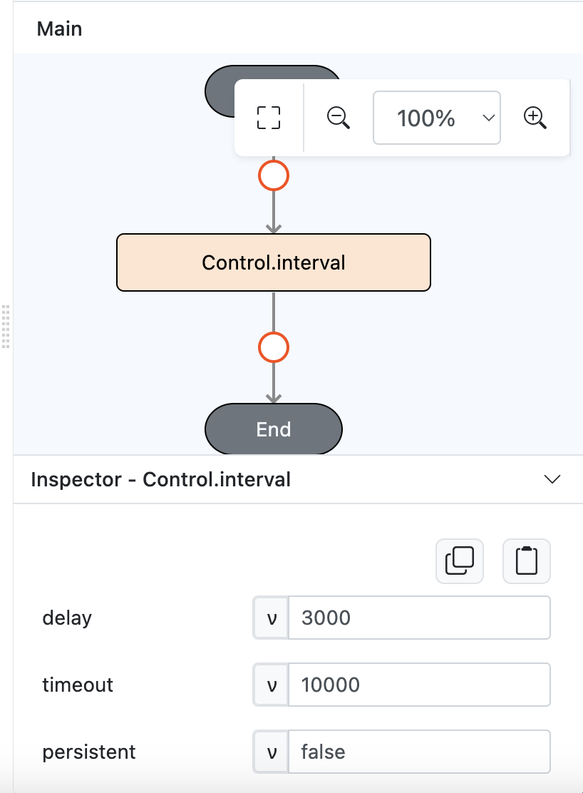

# Control.interval

## Description

Executes a function continuously with the specified interval between each execution. 

## Input / Parameter

| Name       | Description                                             | Input Type | Default | Options | Required |
| ---------- | ------------------------------------------------------- | ---------- | ------- | ------- | -------- |
| delay      | The duration between each run. (In milliseconds)        | Number     | 0       | -       | Yes      |
| timeout    | The duration the output appears for. (In milliseconds)  | Number     | 0       | -       | Yes      |
| persistent | Interval is repeated outside current page or not.       | Boolean    | false   | false, true | No       |

## Output

The function will return interval id if it ran successfully.

## Callback

The action performed if the condition is true.

## Example

In this example, we will pass a condition to check whether two values are equal using the `Logic.equal` function and print the result of the `Control.conditional` function in the console.

### Steps

1. Drag a `button` component into the canvas and open the `Action` tab. Select the `press` event of the button and drag the `Control.interval` function to the event flow.

    

        
    

2. Call the function `Control.interval`. Enter the parameters of the `Control.interval` function.

    

        
    

3. Put a `Log.write` function below `Control.interval` as the callback.

    

        
    

### Result

1. The function will call the callback 3 times based on interval time. Because 10.000 / 3.000 = 3.3 and we will floor to 3, then the callback will called 3 times.
   
    

        
    
