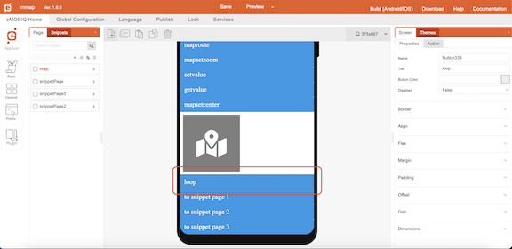
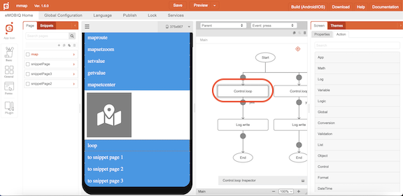

# Control.loop

## Description

Loop through a range of values or a list of elements

## Input / Parameter

| Name | Description | Input Type | Default | Options | Required |
| ------ | ------ | ------ | ------ | ------ | ------ |
| start | The starting point of the range of values to loop through. | Number | - | - | required if “data” has no input |
| end | The ending point of the range of values to loop through. | Number | - | - | required if “data” has no input |
| data | The list of elements to map. | List | - | - | required if “start” OR “end” has no input |
| extra | Additional data to be used in the callbacks. | Any | - | - | No | 

## Output

| Description | Output Type |
| ------ | ------ |
| Returns the formatted information. | Object |

### Object

| Key | Description | Output Type |
| ------ | ------ | ------ |
| success | Boolean value to denote whether the function was executed successfully. | Text |
| message | The message to print. | Text |
| data | Any additional message or data to print. | Text |

## Callback

### callback

The function to be executed when the loop runs successfully.

## Example

In this example, we will loop through a range of numbers and print the values as they are looped through in the console.

### Steps

1. Drag a button component to a page in the mobile designer and open up the `Action` tab.

    

2. Select the event `click` and drag the `Control.loop` function to the event flow.

    

3. Fill in the parameters of the function.

    

4. Drag the function to be executed if the loop function is successful to the node below the function. In this example, we are using the `Log.write` function and change the parameters dropdown to use `input`

    

### Result

1. The range of values will be printed in the console.

    

        
    

