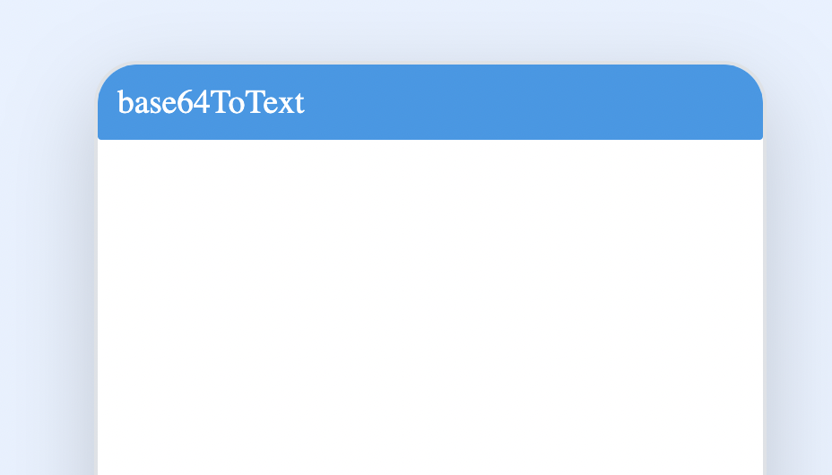
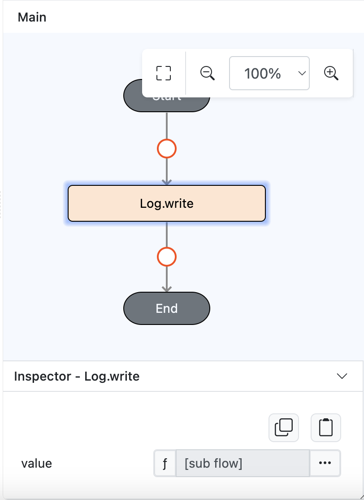
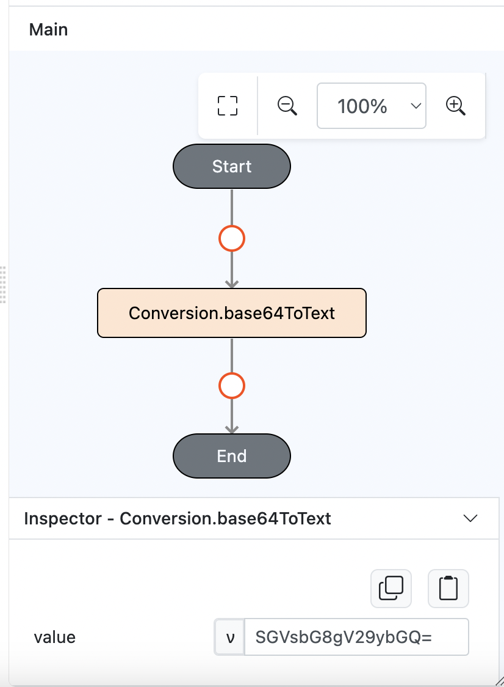
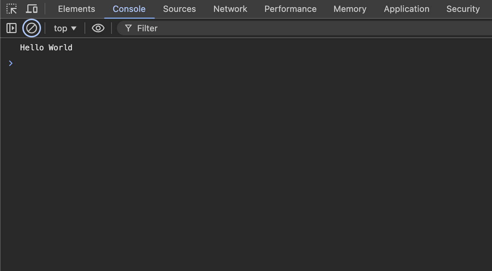

# Conversion.base64ToText

## Description

Decode an encoded base64 string.

## Input / Parameter

| Name  | Description                                             | Input Type | Default | Options | Required |
| ----- | ------------------------------------------------------- | ---------- | ------- | ------- | -------- |
| value | The text to be decoded.       | Text  | -       | -       | Yes      |

## Output

| Description                                   | Output Type |
| --------------------------------------------- | ----------- |
| Returns the decoded text.        | Object      |

## Example

In this example, we will convert a base64 to string and print the result in the console.

### Steps

1. Drag a `Button` component into the service page that will trigger the Base64 decoding action.

    

        
    

2. Drag `Log.write` to event flow and put `Conversion.base64ToText` inside the function parameter.

    

        
    

3. Drag the `Conversion.base64ToText` function to the `Log.write` event function. Fill in the parameter with the Base64 encoded text or list to be converted.

    

        
    

### Result

1. Upon pressing the button, the Base64 encoded will be decoded back into its original string.

    

        
    
