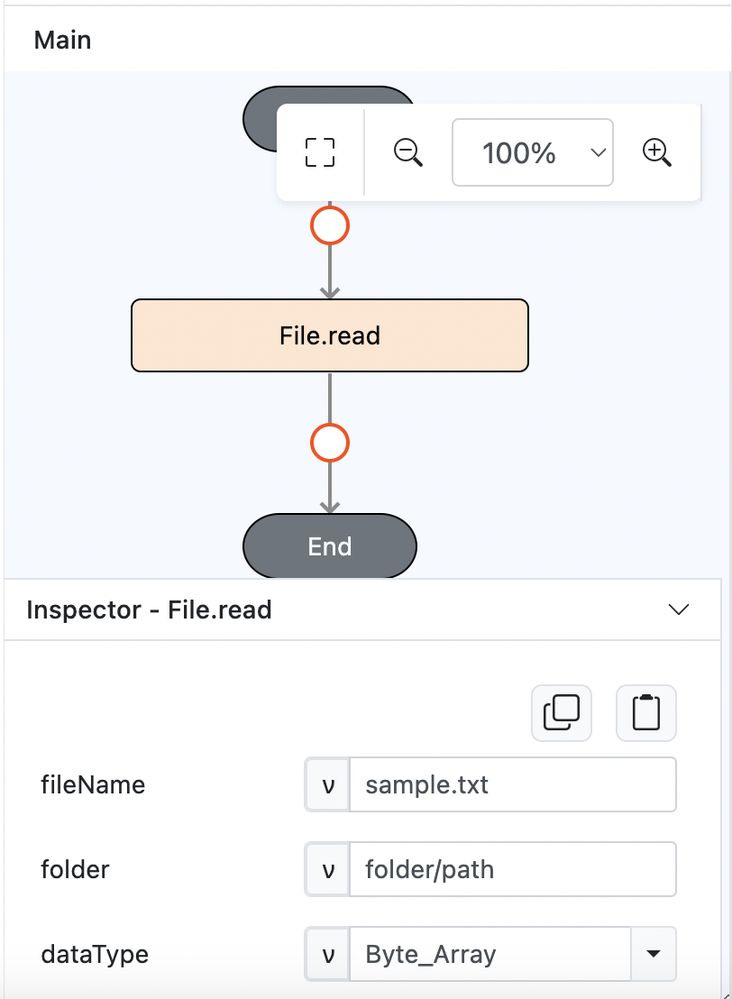

# Conversion.binaryToBase64

## Description

Converts binary data of image (text or list) that taken from a link / storage into a Base64 encoded string.

## Input / Parameter

| Name  | Description                                                             | Input Type | Default | Options | Required |
| ----- | ----------------------------------------------------------------------- | ---------- | ------- | ------- | -------- |
| value | The binary data to be converted to Base64. Can be a string or a list. | Text/List  | -       | -       | Yes      |
| extra | Any additional value that is passed to all the callbacks.              | Any        | -       | -       | No       |

## Output

| Description                                 | Output Type |
| ------------------------------------------- | ----------- |
| Returns the formatted information.          | List      |

## Callback

### callback

The action performed if this function runs successfully.

| Description                                     | Output Type |
| ----------------------------------------------- | ----------- |
| Returns the Base64 encoded data.                | Object      |

### errorCallback

The action performed if this function does not run successfully.

| Description                                 | Output Type |
| ------------------------------------------- | ----------- |
| Returns an error message.                   | Text       |

## Example

In this example, we will convert binary data into a Base64 string when a button is pressed.

### Steps

1. Drag a `Button` component into the service page that will trigger the Base64 conversion action.

    

        
    

2. Select the event `press` for the button and drag the `Conversion.binaryToBase64` function to the event flow. Fill in the parameters: value (the binary data) and any extra data as needed.

    

        
    

3. Put `Log.write` function below the `Conversion.binaryToBase64`, to get the result.

    

        
    

### Result

1. Upon pressing the button, the binary data will be converted to a Base64 encoded string.

    

        
    
