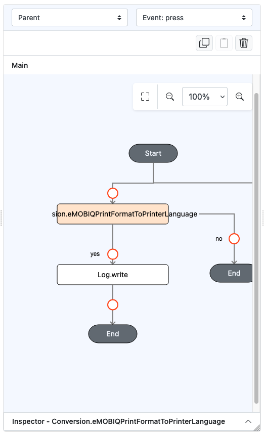
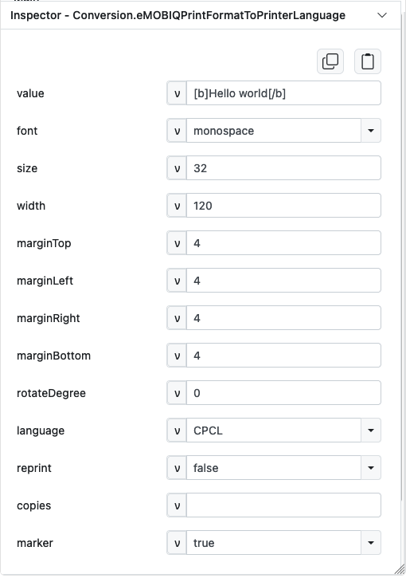
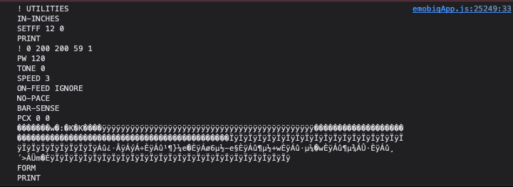

# Conversion.eMOBIQPrintFormatToPrinterLanguage

## Description

Generate the printer language based on a specific text print format which may include images..

## Input / Parameter

| Name         | Description                                                                                  | Input Type | Default   | Options                        | Required |
|--------------|----------------------------------------------------------------------------------------------|------------|-----------|--------------------------------|----------|
| value        | The text with a specific format to be drawn in the canvas. See Text Format after this table. | Text       | -         | -                              | Yes      |
| font         | The name of the font to be used.                                                             | Text       | monospace | monospace, ocrb                | No       |
| size         | The size of the font to be used.                                                             | Number     | 24        | -                              | No       |
| width        | The width of the print format.                                                               | Number     | 576       | -                              | No       |
| marginTop    | The margin top value of the print format.                                                    | Number     | -         | -                              | No       |
| marginLeft   | The margin left value of the print format.                                                   | Number     | -         | -                              | No       |
| marginRight  | The margin right value of the print format.                                                  | Number     | -         | -                              | No       |
| marginDown   | The margin down value of the print format.                                                   | Number     | -         | -                              | No       |
| rotateDegree | The degree of rotation of the print format.                                                  | Number     | -         | -                              | No       |
| language     | The printing language to convert the print format to.                                        | Text       | CPCL      | CPCL, ExPCL, ESCP, ESCPOS, ZPL | No       |
| reprint      | To enable reprint or not.                                                                    | Boolean    | -         | -                              | No       |
| copies       | The number of copies to print. (Applicable for CPCL language only.)                          | Number     | -         | -                              | No       |
| marker       | To show black mark or not. (Applicable for CPCL language only.)                              | Boolean    | -         | -                              | No       |

#### Text format

- Bold: [b]The text to apply bold.[/b]
- Italic: [i]The text to apply italic.[/i]
- Image: [img|x={number}|y={number}|width={number}|height={number}]The image to be rendered, a base64 or url. The image url must not block CORS.[/img]
- Font: [font]The text to apply the font.[/font]
- Size: [size={number}]The text to apply the size.[/size]
- Linespace: [linespace={number}]The text to apply the linespace.[/linespace]
- Alignment: [alignment={left|right}]The text to apply the alignment, where it will start.[/alignment]
- Underline: [u]The text to apply underline.[/u]
- Strikethrough: [s]The text to apply strikethrough.[/s]

## Output

| Description                                         | Output Type |
|-----------------------------------------------------|-------------|
| Returns the converted text into a printer language. | Text        |

## Example

In this example, we will attempt to generate a print format in CPCL and observe the raw output on the screen.
- Depending on the chosen language, the output generated will produce a string of text that is readable by the printer supporting the language.

### Steps

1. Drag a `Button` component into the service page that will trigger the generation.

2. Inside the `pressed` event, drag `Conversion.eMOBIQPrintFormatToPrinterLanguage` to event flow. Just under the function, place another block of function to observe the output. In this case, we'll use `Log.write`.

    

        
    

3. Fill up the paramters for `Conversion.eMOBIQPrintFormatToPrinterLanguage` as follows

    

        
    

### Result

1. Upon pressing the button, the generation can be observed in the console. 

    

        
    

