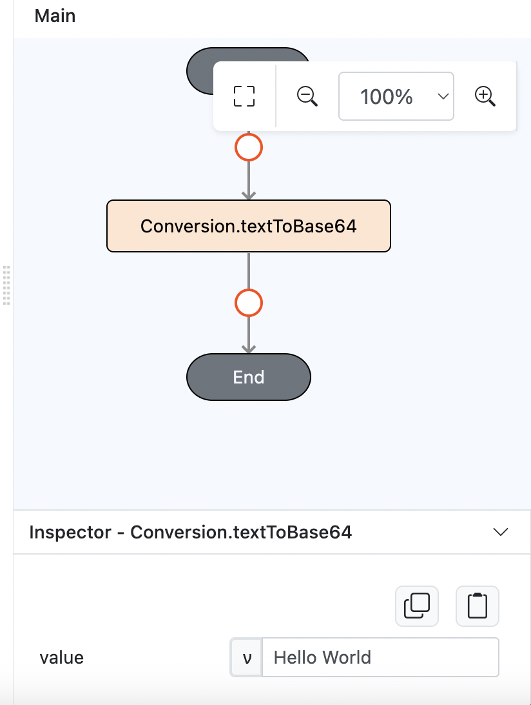

# Conversion.textToBase64

## Description

Converts text into a Base64 encoded string.

## Input / Parameter

| Name  | Description                                              | Input Type | Default | Options | Required |
| ----- | -------------------------------------------------------  | ---------- | ------- | ------- | -------- |
| value | The text to be converted to Base64.                      | Text/List  | -       | -       | Yes      |

## Output

| Description                                   | Output Type |
| --------------------------------------------- | ----------- |
| Returns the base64.                           | Text        |

## Example

In this example, we will convert a string to base64 and print the result in the console.

### Steps

1. Drag a `Button` component into the service page that will trigger the Base64 conversion action.

    

        
    

2. Drag `Log.write` to event flow and put `Conversion.textToBase64` inside the function parameter.
    
    

        
    

3. Drag the `Conversion.textToBase64` function to the `Log.write` event function. Fill in the parameter with the text or list to be converted.

    

        
    

### Result

1. Upon pressing the button, the text will be converted to a Base64 encoded string.
   
    

        
    
