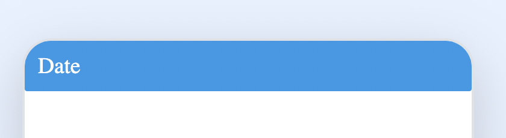
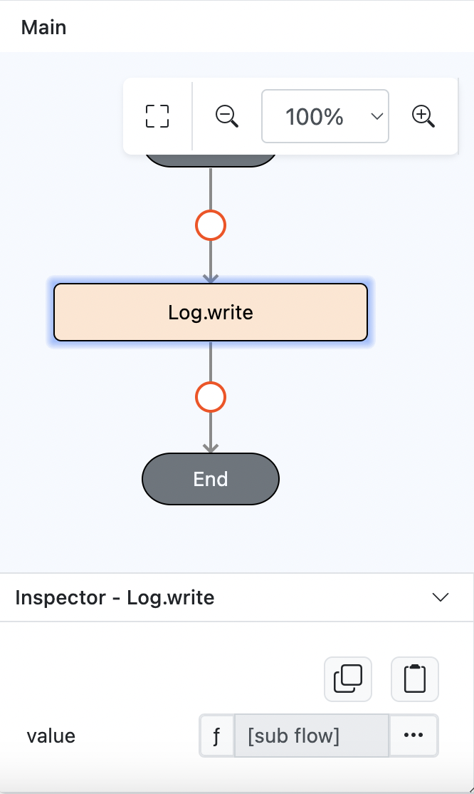
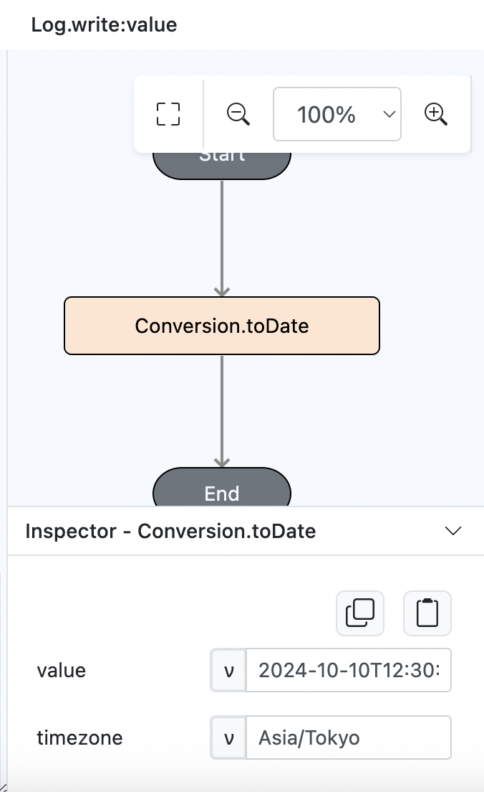
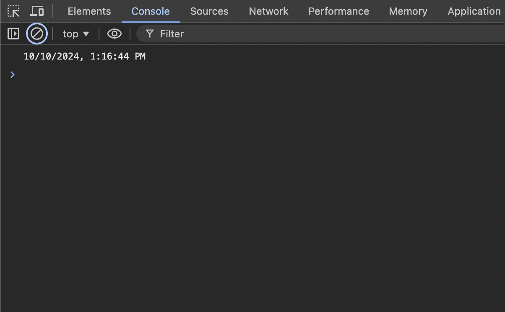

# Conversion.toDate

## Description

Converts a date from one timezone to another.

## Input / Parameter

| Name     | Description                                                                   | Input Type | Default | Options | Required |
| -------- | ----------------------------------------------------------------------------- | ---------- | ------- | ------- | -------- |
| value    | The datetime to be modified. Default value is the current date at UTC+00:00.  | Text       | -       | -       | No       |
| timezone | The timezone to apply.                                                        | Text       | -       | -       | Yes      |

## Output

| Description                    | Output Type |
| ------------------------------ | ----------- |
| Returns the modified datetime. | Text        |

## Example

In this example, we will convert a string into date using `Asia/Tokyo` as the timezone.

### Step

1. Drag a `button` component into the canvas and open the `Action` tab. Select the `press` event of the button.

    

        
    

2. Add `Log.write` function and add a subflow on it's value.

    

        
    

3. Then put `Conversion.toDate` inside it and fill the value as "2024-10-10T12:30:00" and the timezone as "Asia/Tokyo".
   
    

        
    

### Result

1. The console will return the formatted date from the string. (10/10/2024, 1:16:44 PM)
   
    

        
    
