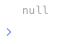

# Conversion.toNull

## Description

Returns a value of type null.

## Input / Parameter

N/A

## Output

| Description | Output Type |
| ------ | ------ |
| Returns the value of type null. | Null |

## Example

In this example, we will use the `Conversion.toNull` function to print `null` in the console.

### Step

1. Call the function `Conversion.toNull` inside the `Log.write` function.

    

        
    

### Result

1. The console will print `null`.

    

        
    

