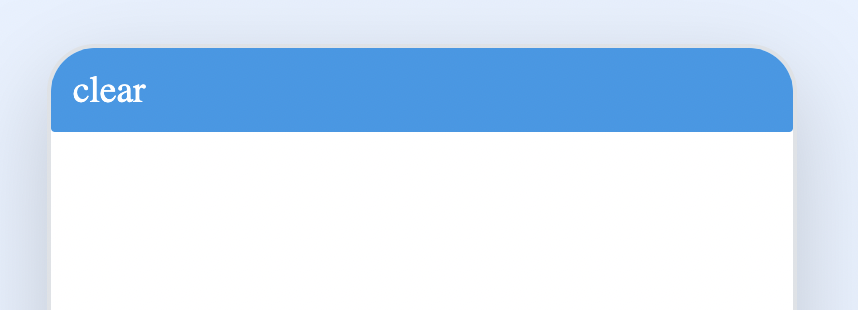
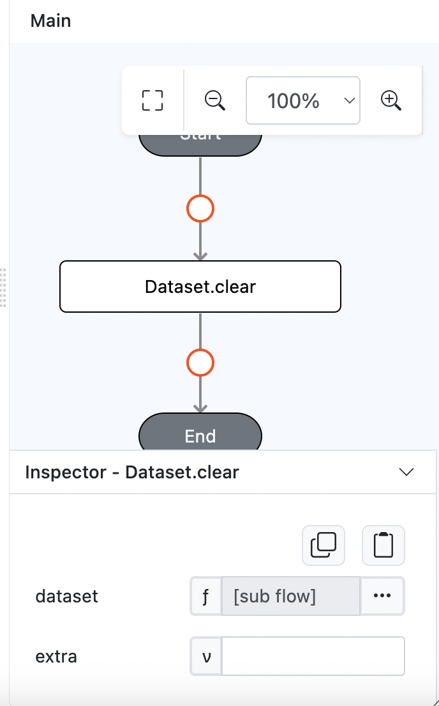
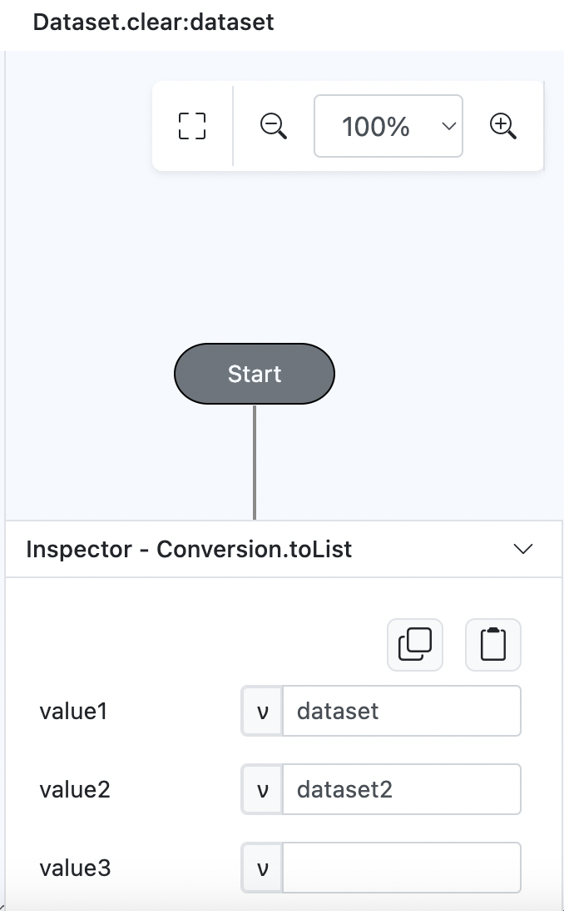

# Dataset.clear

## Description

Clears all rows of data from a specified dataset.

## Input / Parameter

| Name    | Description                                             | Input Type | Default | Options | Required |
| ------- | -------------------------------------------------------| ---------- | ------- | ------- | -------- |
| dataset | The name of the dataset that will be cleared.         | Text/List  | -       | -       | Yes      |
| extra   | The stored value that is passed to all the callbacks.  | Any        | -       | -       | No       |

## Output

| Description                                  | Output Type |
| --------------------------------------------- | ----------- |
| Returns the formatted information.            | Object      |

## Callback

### callback

The action performed if this function runs successfully.

| Description                                  | Output Type |
| --------------------------------------------- | ----------- |
| Returns a confirmation of the clearing action.| Object      |

### errorCallback

The action performed if this function does not run successfully.

| Description                                  | Output Type |
| --------------------------------------------- | ----------- |
| Returns an error message.                    | Text       |

## Example

In this example, we will clear all rows of data from a specified datasets.

### Steps

1. Drag a `Button` component into the service page that will trigger the clearing action.

    

        
    

2. Select the event `press` for the button and drag the `Dataset.clear` function to the event flow. Fill in the parameters with the list of the datasets you want to clear.

    

        
    

     

        
    

### Result

1. Upon pressing the button, all rows of data from the specified dataset will be cleared.