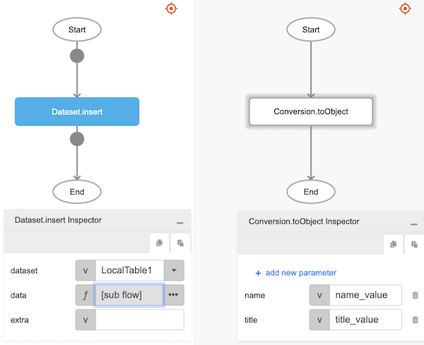
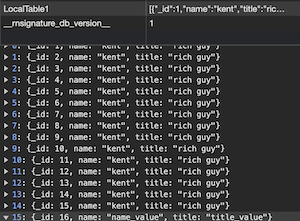

# Dataset.insert

## Description

Inserts rows of data into a dataset.

## Input / Parameter

| Name | Description | Input Type | Default | Options | Required |
| ------ | ------ | ------ | ------ | ------ | ------ |
| dataset | The name of the dataset that is created in Services. | Text | - | - | Yes |
| data | Multiple dynamic attributes with values associated with each attribute. | Object | - | - | Yes |
| extra | The stored value that is passed to all the callbacks. | Any | - | - | No |

## Output

| Description | Output Type |
| ------ | ------ |
| Returns the formatted information. | Object |

### Object

| Key | Description | Output Type |
| ------ | ------ | ------ |
| success | Boolean value to denote whether the function was executed successfully. | Text |
| message | The message to print. | Text |
| data | Any additional message or data to print. | Text |

## Callback

### callback

The action performed if this function runs successfully.

| Description | Output Type |
| ------ | ------ |
| Returns the newly created data. | Object |

### errorCallback

The action performed if this function does not run successfully.

| Description | Output Type |
| ------ | ------ |
| Returns an error message. | Text |

## Example

The user wants to insert rows of data to their local storage.

### Steps

| No. | Description |  |
| ------ | ------ | ------ |
| 1. |  | Drag a `Local Table` component into the services panel in the service page and then fill the fields. For `fields` field value add `name`and `title` as object key with Text type. |
| 2. |  | Drag a button component to a page in the mobile designer. |
| 3. |  | Select the event `press` and drag the `Dataset.insert` function to the event flow and fill in the parameter, for the `data` param change it's type to a function / subflow and put `Conversion.toObject` inside it then add `name`, `title` as object key with `name_value`, `title_value` as it's value respectively. |
| 4. |  | Open the preview and try to press the Button, new data should be added on local storage. |

### Result

The new rows of data should be stored on local storage.
